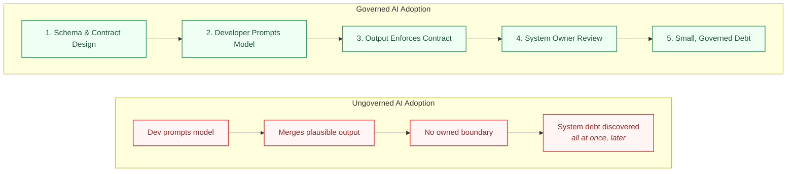

# AI Exposes Gaps in Architecture Design

I keep getting the same complaint from junior developers who fell in love with understanding systems under the hood and now feel like their field is disappearing. They ask why companies would hire an engineering team when one exhausted senior can babysit an AI model until it spits out something passable.

They aren't wrong about what they are seeing on the ground. But they are misdiagnosing the root cause.

---

## The Blind Spot: Blaming the Tool for a Process Failure

This is the exact same pattern I've written about before, just wearing a new outfit:

* **When [Blueprints arrived in Unreal Engine](BlueprintMess.md):** The blame landed on visual scripting. But the real failure was that removing code friction removed the *only* checkpoint where architectural discipline got enforced by default. The compile step was accidentally forcing developers to slow down and think.
* **When AI-assisted code arrived:** The complaint became "AI is replacing engineers." But the actual mechanism is identical: *AI removed the friction that used to force a human to stop and design the structure.*

If your team never had a process that enforced architecture on purpose, removing that natural friction leaves you with whatever discipline you actually had. For many teams, that turned out to be far less than they thought.

> **The Hiring Misconception:** Live-coding interviews never actually measured engineering judgment. Research shows that [observation degrades performance](https://par.nsf.gov/servlets/purl/10196170) and that "thinking out loud" [breaks down on complex problems](https://dl.acm.org/doi/pdf/10.1145/2379057.2379065). We were never testing whether candidates could design scalable systems, we were testing if they could **perform fluent syntax generation under pressure**. AI is now trivially better at that performance than any human.

A messy design doc fed into a designer produces messy Blueprints. A messy prompt fed into an LLM produces a messy pull request. The need for someone to think clearly about system architecture before touching the keyboard never disappeared, it just stopped being something the tooling did for you by accident.

---

## The Fix: Govern the Output

You don't need a brand-new playbook for AI code generation. The risk profile of an AI model is identical to any fast, high-volume, low-context contributor (like an entry-level dev or a designer writing logic): **it produces plausible-looking work faster than anyone is verifying that it fits the architecture.**

To manage this velocity without breaking your project, apply four architectural rules:

### 1. Lock the Schema First

This is the same [Schema Lock pattern](BlueprintMess.md) used to keep designers out of engine-level logic. Don't give AI or junior contributors open access to "just write code anywhere." Define a narrow, explicit contract first, a typed interface, a `UPROPERTY` boundary, or a data asset structure. Safety comes from the fact that **an architect designed the boundary in advance**, leaving the fast producer to fill in only the logic inside it.

### 2. Treat AI Code Like an Engine Fork

As I explored in [Upgrading Game Engines Safely](EngineUpgradeCase.md), when gameplay code reaches directly into engine internals, the fix isn't "never touch the engine" (it's an owned adapter layer so an engine update costs you one class change instead of 400 call sites). AI code requires the exact same treatment: a narrow, reviewed seam between generated code and your core systems.

### 3. Surface Hidden Costs Immediately

As shown in [The Invisible Bottleneck](SilentBuildProblem.md), systemic damage happens when no one tracks accumulating technical debt until it explodes as a multi-day rebuild. The fix is a clear, boring process: **flag the boundary, assign an owner, require written justification, and fail the CI pipeline if the pattern is violated.**

### 4. Hire for Boundary Design, Not Typing Speed

Live-coding interviews measure a skill that AI now provides for free. A judgment-focused technical interview evaluates what actually matters: Can this engineer draw clean system boundaries before writing code? Do they use abstraction wrappers instead of silent hacks? Do they make hidden technical debt visible? Do they know when an abstraction is worth its cost and when it isn't, the same judgment call behind [the true price of a virtual function](VirtualFunctions.md) or [knowing when Tick() is the wrong tool](TickPitfalls.md)?

---

## The Insight: AI Forces Architecture Into the Open

Unreal Engine's transition toward Verse follows the exact same trajectory ([Engineer-Designer Boundary in Unreal Engine](BlueprintMess.md)). The backlash against Verse wasn't about text vs. nodes: it was the fear of losing the ability to take quick, invisible shortcuts. Verse makes the mess legible: it shows up in a text diff, gets caught in code review, and can't hide inside a visual graph anymore.

AI is doing the same thing to software development at scale. It doesn't remove the need for system architects, it removes the last place where lack of architecture could hide.

Without the natural slowdown of typing code by hand, the absence of real architecture stops being a slow, manageable leak and becomes an instant flood.

---

## The Production Bottom Line

> **Reallocated Value, Not Disappearing Value:** The despair over AI replacing teams and the frustration over live-coding interviews stem from the same mistake: assuming syntax generation was the core engineering skill. It wasn't. Writing code by hand was simply the visible proxy we used because it was slow enough to force some architectural thinking along the way.
>
> AI made that proxy irrelevant by making syntax generation free. What remains (more visible and valuable than ever) is the engineer who can draw boundaries, enforce contracts, and keep technical debt visible. The demand for that skill didn't disappear. It just stopped being able to hide behind a compile step.