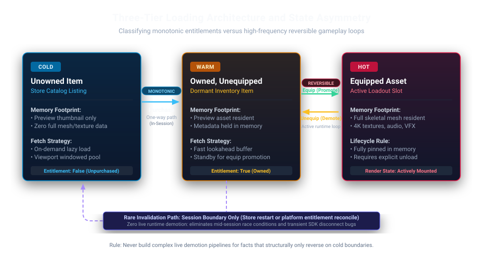

# The Silent Asset Loading Bottleneck

The first time the inventory screen dropped frames, it was easy to explain away. A small hitch on open, gone a moment later: the kind of thing that shows up in a profiler as a thin, forgettable spike. Nobody filed a bug. There was nothing yet worth fixing.

Then we shipped a new pack of cosmetics. The hitch got a little worse. Then another pack, and it got worse again, a slow, steady climb that never crossed a line dramatic enough to stop and ask why. Every single pack was a completely reasonable thing to ship on its own. Nobody looked at the inventory screen and decided to make it slower. It just kept absorbing a small tax with every addition, quietly, until a feature came along that had nothing to do with any of it: a design that wanted animations playing on top of the inventory screen while it was open. A hitch that used to live for a fraction of a second under a static UI was about to sit directly underneath motion, for as long as the screen stayed open, every single time.

That was the moment the cost stopped being ignorable. Not because it had gotten worse on its own terms, but because something else had just changed what the player would actually see. And once I went looking for where the time was actually going, the answer wasn't a bad algorithm or an unoptimized shader. It was an architectural decision, except nobody had ever made it. The inventory loaded everything it referenced, every time, because that is simply what happens by default in both Unity and Unreal, unless someone deliberately tells the engine to do something else. **Nobody chose eager loading. It just shipped.**

---

### The Blind Spot: A Default Nobody Owns

There is a body of knowledge that exists specifically to name this decision, and it did not come from game engines. It came from database and ORM tooling decades ago, in the form of a question every framework like Hibernate or Entity Framework forces a developer to answer explicitly for every relationship in a data model: when a parent record loads, do its related records load with it (eager), or only once something actually asks for them (lazy)?

Neither answer is universally correct. What matters is that the framework makes you pick, on purpose, for every relationship. The tooling assumes, correctly, that the two choices carry wildly different costs depending on how the data is actually used. Game engines do not force that choice.

#### 1. The Ergonomic Tradeoff Behind Engine Defaults

Eager loading is not an accidental oversight; it is a deliberate ergonomic tradeoff made once, upstream, by engine architects building general-purpose tools for projects of every scale.

Synchronous, resident-by-default assets mean a developer never has to design around a loading spinner, never has to null-check an async handle that might not have resolved yet, and never has to handle visual popping while an asset streams in behind a placeholder. For a small game or a rapid prototype, that tradeoff is essentially free. Defaulting to eager loading optimizes for developer velocity across the widest possible range of projects.

The problem is not that the choice was wrong. The problem is that it was made once, generically, at engine-design time, then silently inherited by every project built on top of it, at whatever scale that project eventually reached, without anyone at the project level ever being prompted to revisit it.

#### 2. How Unity and Unreal Hide the Switch

In Unity, a component loads whatever it references the moment that component loads, unless you explicitly route it through Addressables or hand-roll your own AssetBundle loading.

Unreal is even more explicit about where the line sits: a plain `TObjectPtr` reference is a hard reference, and anything held behind one loads synchronously the instant the outer object loads. Opting out requires changing the reference's actual type to a `TSoftObjectPtr` or an `FSoftObjectPath`, and then explicitly asking the Asset Manager or Streamable Manager to resolve it when needed.

That detail matters: **lazy loading in Unreal is not a flag you flip, but a different type you have to choose deliberately, reference by reference.** The engine treats eager loading as the default state of matter and lazy loading as an opt-in override, which is why it is so easy to overlook. It is no coincidence that Unreal's documentation notes the Asset Manager was built specifically to handle games with massive item definitions (the exact shape of an inventory). Two competing engines independently arrived at the same retrofit for the exact same problem. That convergence is the tell: this is not a one-project oversight, but a structural gap in out-of-the-box tooling across the industry.

#### 3. The Transitive Dependency Cascade

Part of why this stays invisible for so long is what a single hard reference actually drags behind it.

An inventory slot's hard reference to a weapon is rarely just a 50-byte struct. That reference pulls in the weapon's skeletal mesh, which pulls in several sets of high-resolution textures, which pull in a particle system for its muzzle flash, which pulls in sound cues and raw audio wave files. None of that shows up when inspecting the item's flat definition. It appears when walking the full dependency tree underneath it, and eager loading resolves every single node of that graph synchronously the instant the root object loads.

That is the true mechanism behind the hitch: you are never loading an item, you are loading its entire universe.

#### 4. The Engine-Side N+1 Problem

The ORM world also has a name for what goes wrong when lazy loading is applied without thinking about access patterns: **the N+1 problem**. Load a list of parent records, then lazily fetch each child individually inside a loop, and instead of one efficient batched query you trigger $N + 1$ round trips.

In a database, that costs network time and connection pool slots (wasteful, but bounded and recoverable). The same mistake in a game engine hits far harder:

* A blocking file I/O stall on a worker thread
* Severe texture streaming pool thrashing as dozens of unbatched loads fight for disk bandwidth
* Allocator churn from opening and closing rapid-fire sub-allocations instead of one clean batch

A database absorbs a few wasted round trips without an end-user batting an eye. A game engine doing the equivalent drops frames, visibly, right in front of the player.

None of this implies carelessness. Every asset pack that shipped was reviewed and correct on its own. The engine default was a reasonable velocity choice that was simply never reassessed at live-service scale. Studios running live-service titles for years talk about this openly at GDC: accumulated content and untracked architectural debt quietly overwhelm a team, and problems affecting only a small slice of the player base are the easiest to miss until that slice becomes the majority. Growth does not announce itself; a new feature does, eventually, the way ours did.

---

### The Fix: Deciding the Fetch Strategy on Purpose

The pattern that solves this comes from storage systems: **tiering by access probability**. Cloud storage classes work this way (hot, warm, and cold tiers), pairing cheap storage for rarely touched data with fast, resident storage for active data, governed by explicit promotion and demotion rules. Applied to game assets, tiering means deciding, on purpose, which representation of an asset lives in memory at any given moment.

#### 1. Viewport Windowing and Lookahead Buffers

The first pass I built for the inventory screen was the simplest version of that idea: load only the asset representations the player is actually looking at. Nothing outside the visible region gets touched. It solved the hitch immediately, providing the leanest answer to loading too much, too early.

Strict visibility loading, however, introduces its own edge case: fast scrolling. Load only what is on screen, and a player flicking through a menu will see icons and meshes visibly pop in a beat late. The fix is not abandoning lazy loading, but adding a **lookahead buffer**: keeping roughly one screen's worth of content loaded just outside the visible edge in either direction. That bounds memory usage almost identically to strict visibility, while giving the streaming pipeline enough lead time that an ordinary scroll never outruns it.

#### 2. Tiered Promotion: Hot, Warm, and Cold

A more deliberate version of this pattern emerged later on a different project in Unreal, solving a sharper problem: cosmetics sold across multiple storefronts (Steam, Epic, PlayStation, Xbox), where an SDK wrapper reduced ownership state down to a simple flag per item. The loading strategy built on that data divided assets into three concrete tiers:

* **The Hot Tier:** Purchased and currently equipped items (full meshes, textures, and sounds resident immediately).
* **The Warm Tier:** Purchased but unequipped items (only lightweight preview thumbnails resident, promoting the full asset on equip).
* **The Cold Tier:** Unowned items (preview-only, promoted to warm on purchase).

The preview tier itself was not loaded in bulk either. It was windowed strictly to what the UI needed to render, applying the same visibility-driven principle recursively at every tier the architecture had.

#### 3. Monotonic State vs. Protecting Against Broken State

What makes that system work cleanly is an asymmetry that is easy to miss if you build promotion and demotion identically by default: **purchase state and equip state have completely different frequencies of reversal.**

Equip state is reversible constantly, in the middle of active play. It requires both directions built and verified live: full asset promotion on equip, demotion to preview on unequip.

Purchase state, as the player experiences it, moves in one direction almost all of the time; players do not un-purchase items during normal gameplay. Storefront chargebacks, customer support refunds, and entitlement syncs do occur, but they are low-frequency anomalies. Designing around that reality means treating purchase state as strictly monotonic during an active session for two distinct architectural reasons:

1. **Avoiding Overengineering Rare State:** Building a live, instant eviction pipeline for an event that might happen once in ten thousand sessions wastes development bandwidth and creates unnecessary runtime overhead.
2. **Eliminating Attack Surface for Broken State:** The moment you create an active runtime code path capable of stripping ownership mid-session, you create the opportunity for race conditions, dropped network packets, and cache sync bugs to accidentally un-own a player's item while they are actively using it. By making purchase state strictly monotonic during gameplay and confining reversals to asynchronous boundary checks (verified only on session start or when re-entering the store), you guarantee that transient platform SDK hiccups cannot corrupt active player state mid-match.

#### 4. Demotion Demands Explicit Lifecycle Management

Demotion itself demands precision, because in modern game engines, **demotion is not automatic eviction**:

* In **Unity (Addressables)**, releasing your internal reference does not free memory until you explicitly call `Addressables.Release()`. Skip that call, and the reference count stays pinned indefinitely.
* In **Unreal**, clearing a hard pointer loaded from a `TSoftObjectPtr` leaves the underlying `UObject` resident in memory until the next Garbage Collection pass sweeps it, or until an Asset Manager primary asset bundle actively unloads it.

Demotion is an explicit lifecycle requirement. Assuming memory vanishes the instant a pointer is set to null is the exact oversight a memory profiler exposes the moment your frame-time profiler finally goes quiet.

## The Practice: Classify the Fact Before You Build the Cache

Two architectural takeaways generalize past both of these systems into any project:

### 1. Identify Monotonic vs. Reversible Facts First

Before writing a single line of promotion or eviction logic, ask: **how often does the underlying fact actually reverse, and how fast must the system react when it does?**

* **Monotonic facts** (a purchase, an account level reached, an achievement unlocked) move in one direction during standard play. Handling reversals at natural session boundaries eliminates unnecessary runtime complexity without leaking resources.
* **Reversible facts** (an equip slot, a loadout selection, a toggled graphics setting) oscillate constantly. Skipping their demotion path is not a harmless shortcut; it is a delayed memory leak.

Knowing where a fact sits on that frequency spectrum dictates both how much lifecycle code you must write and how urgently it has to run.

### 2. Audit Costs When Exposure Changes

Nobody caught the inventory cost through a scheduled audit. It surfaced because a separate UI feature exposed an existing tax to motion.

That is the exact mechanism detailed in Where Abstraction Meets the Hot Path for a different class of problem: an abstraction chain that only collapsed performance once a stash tab began evaluating three hundred items simultaneously instead of one. In that case, call frequency changed underneath a stable call stack; here, visual exposure changed underneath an unexamined loading default. The takeaway is identical: **the moment to profile is not just on a calendar schedule, but whenever an upstream feature changes how visibly a quiet cost matters.**

---

## The Production Bottom Line

>A default nobody chose is still an architectural decision; it simply lacks an owner until production forces the issue.
>
>Eager versus lazy loading has been a documented discipline in database engineering for decades, complete with well-known failure modes and battle-tested solutions. Gameplay engineers are rarely handed that vocabulary early in their careers, so teams repeatedly rediscover the same traps from scratch, one frame drop at a time, whenever a project grows past the point where eager loading was free.
>
>The remedy is straightforward once you have the language for it: **virtualize what is visible, verify whether the underlying state can reverse before designing its eviction path, and apply those boundaries recursively at every tier in the stack.**