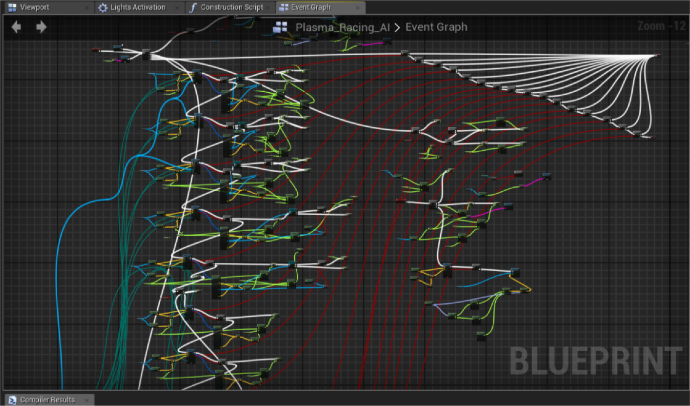
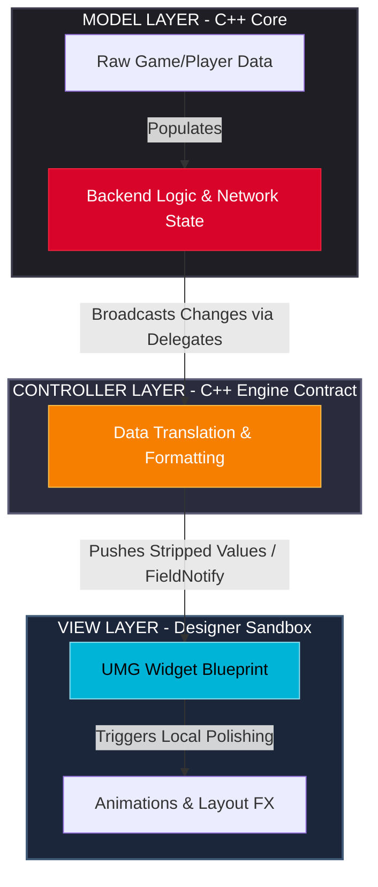

# Engineer-Designer Boundary in Unreal Engine

When I transitioned into the Unreal Engine ecosystem after years of working with clean, text-based compilation loops, the very first question I had to answer was fundamental to long-term project health: **Where exactly do we draw the line between C++ and Blueprints?**



This isn't a simple convention question; it is an engineering leadership problem. The game development industry is currently navigating massive anxiety over Epic Games’ roadmap for Unreal Engine 6, where Blueprints are marked for eventual deprecation in favor of the text-based Verse language. But looking closely at production realities, this structural shift was entirely predictable. The issue was never the visual node editor itself—it was the collapse of team discipline and architectural boundaries that the visual workflow inadvertently allowed.

## The Blind Spot: "Making It Work at Any Cost"

In a fast-paced game studio, the instant feedback loop of Blueprints becomes a double-edged sword. Because a designer can modify logic and test it immediately without waiting for a C++ compile step, the pressure to hit short-term milestones shifts focus entirely away from scalable software architecture.

Over a production cycle, this creates a predictable pattern of severe technical debt:

* **Ignoring Structural Tools:** Systems-building features like `UInterfaces` or proper class inheritance are ignored. Instead of building modular, extensible pieces, logic is duplicated across completely unrelated Actor Blueprints.
* **The Memory Graph Trap:** Hard object references are dropped casually into UI widgets and level blueprints, creating hidden reference chains that keep assets and objects alive far longer than intended. Separately, large structs passed by value introduce silent copy costs that only show up later in profiling.
* **Blurred Responsibilities:** Designers, trying to stay independent and keep moving, start writing heavy data-processing algorithms inside standard graph macros. When the node nets inevitably turn into un-mergeable spaghetti or tank the frame rate, engineers are pulled from core systems to act as high-priced firefighters.

The root problem is human. Designers aren't missing these patterns out of malice; they miss them because **we, as engineers, fail to provide clear, actionable architectural frameworks that simplify their decision-making.**

---

## The Fix: Process and Mental Models

To build a sustainable pipeline, engineers must step into the role of software architects who build safe sandboxes. We need to implement clear pillars: structural processes that force collaboration, and simple mental models that guide design choices.

### 1. The Model-View-Controller (MVC) Framework for UI

If you tell a designer to "keep the blueprint clean," it means nothing. If you give them a strict structural pattern to follow, you eliminate the cognitive load of figuring out *where* data and logic belong.

For user interfaces, propagating an MVC/MVVM mindset directly inside UMG (Unreal Motion Graphics) establishes a clean, human-proof division of labor:



Under this pattern, the designer’s rulebook becomes binary: **The View is dumb.**
The widget blueprint is never allowed to fetch data directly from the player state, cast to the game mode, or calculate character attributes. It simply listens to data pushed down from the Controller layer. If a value changes, the View updates a text block or triggers an animation. By simplifying the choices down to "just display what you are given," designers stop writing engineering-level logic inside layout files.

### 2. The Sandbox Rule: Componentization vs. Orchestration

To prevent designers from writing complex algorithms inside standard actor graphs, we train them to look at features through a strict behavioral framework:

* **Components are Atomic Actions (C++):** A component does *one* thing perfectly, in isolation. For example, a `HealthComponent` modifies an integer and throws an event. A `StatusEffectComponent` applies a timer. Components should minimize assumptions about the game world and communicate through narrow events or interfaces.
* **Orchestrators are the Directing Layer (Blueprints):** An orchestrator listens to component events and sequences them visually. When the `HealthComponent` throws an `OnDeath` event, the Blueprint orchestrator tells the mesh to play a montage, spawns a particle effect, and plays a sound cue.


### 3. Structural Process: The Schema Lock

To stop designers from sneaking logic into visual scripts to avoid a long C++ compilation delay, we have to create explicit entry points inside our C++ base classes. We use strict `UPROPERTY` and `UFUNCTION` macros to build a safe, predictable sandbox:

```cpp
// AMyPlayerCharacter.h - The Engineering Contract
UCLASS()
class MYGAME_API AMyPlayerCharacter : public ACharacter
{
    GENERATED_BODY()

protected:
    // Safe for designers to read, but they cannot break the raw pointer tracking
    UPROPERTY(BlueprintReadOnly, Category = "Inventory", meta = (AllowPrivateAccess = "true"))
    class UInventoryComponent* InventoryComponent;

    // The explicit hook for designer creativity - no logic happens here in C++
    UFUNCTION(BlueprintImplementableEvent, Category = "VFX")
    void OnHealthThresholdReached(float CurrentHealthPercent);
};

```

To back this up, the technical pipeline must be built into team communication:

* **The Pre-Implementation Sync:** Before a feature is touched in the editor, the engineer and designer co-author a single-page technical design document. They identify the data schema contract—agreeing on what variables the designer needs access to (`BlueprintReadOnly`) and what visual triggers are required (`BlueprintImplementableEvent`).
* **Data-Driven Sandboxes (`UDataAsset`):** For raw behavioral variations, we move designers out of scripting graphs entirely. If an enemy needs a new attack profile, the designer doesn't script a new behavior node network; they fill out raw data fields in a static configuration asset that the C++ system reads natively.

---

## The Insight: Why UE6 Is Forcing This Evolution

This exact friction between human workflow and software discipline explains why the industry is seeing so much volatility around Epic's shift toward Verse in Unreal Engine 6.

The backlash isn't actually about losing a node editor. **It is the fear of losing the ability to take shortcuts.**

Let's be realistic: Verse won't fix human nature. Technology changes, but the tendency to take shortcuts is permanent. If a designer writes a messy, chaotic design document and feeds it to a text-based AI agent, they will just receive a messy, chaotic Verse script. Bad logic in means bad logic out. And under tight production deadlines, developers will still try to bypass engineering discipline.

The real magic of the UE6 transition is that it **forces bad habits into the open.**

When a design choice creates a mess in a text-based scripting environment, it generates lines of readable text. It shows up cleanly in a Git or Perforce text diff. It can be parsed by automated code reviewers, easily caught during validation, and refactored before it ever destroys a cooked build.

Technology stacks, syntax rules, and editor interfaces change constantly. That is just part of the job. But data ownership, clean decoupling, and solid systems architecture are permanent. The technical leads and engineers who excel in the next era of development won't be the ones mourning their old node networks—they will be the ones who know how to design clear frameworks that empower designers to create, while cleanly protecting the health of the codebase.
