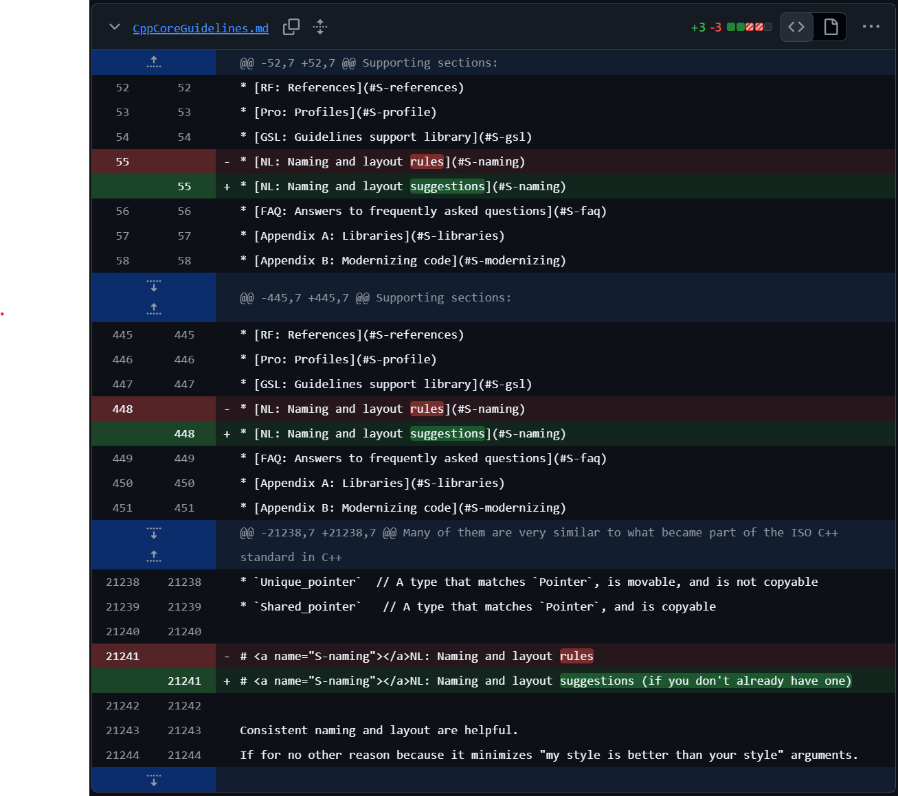
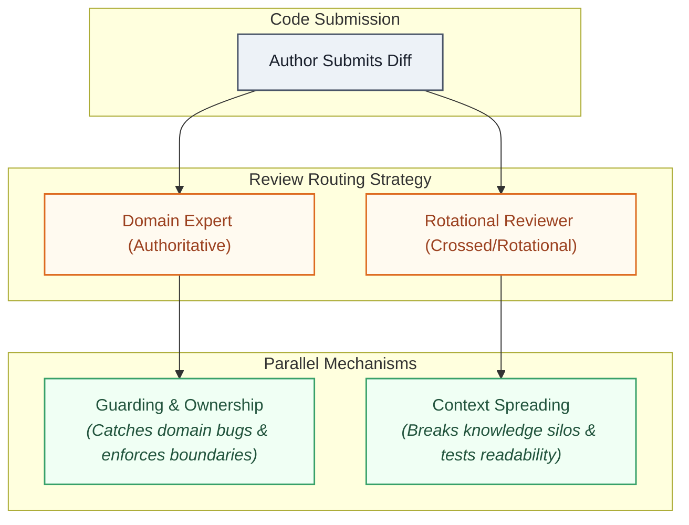

# Code Review as Architecture Governance

I was new to the team. The processes were loose, and a few days in, I asked around about how people read urgency on a review request. One person said they read it off the Jira ticket. Another said urgency was really about how much time felt acceptable before picking a review up, with the lowest tier landing somewhere around "sometime this week." Then the tech lead walked past and said none of that was quite right, without saying what was.

The next day I ran into the same fog somewhere else: approve versus upvote. My instinct was that if I wasn't the assigned reviewer, I only upvote. Except in the review I was looking at, there was no assigned reviewer at all.

The same day, I watched it play out for real. An author used exactly that ambiguity in a comment thread, and the reviewer, rather than push back, approved the change without waiting for the fix. At the time I read it as a reviewer avoiding conflict, protecting the relationship over the diff. Looking back, I think that framing let everyone off too easy. It wasn't relationship-preservation: it was ignorance wearing relationship's clothes. Nobody had ever said out loud that holding a technical line doesn't cost the relationship, so the reviewer had no way to tell the two apart, and caved on the one they could actually see.

One small gap, and everything sitting behind it showed up within 48 hours. That was bright enough that I sat down and started writing a process document: not a new process, just a formal account of the one already running informally, with the gaps filled in.

Code review gets treated as a settled thing, a golden standard every engineering team already agrees on. It earns that reputation honestly, but not for one reason. It catches mistakes before they ship, it teaches, it spreads context across a team, it builds a record, and it shapes culture, all inside the same ritual. It isn't only a technical process: it's a social one wearing a technical process's clothes. That breadth is exactly why it's dangerous to leave implicit. A process doing six jobs at once needs six names, not one, or the five nobody named quietly stop happening, and something that isn't actually a job at all starts filling the silence instead.

---

## The Blind Spot: One Named Job, Five Invisible Ones

Ask a team what code review is for, and you'll get a version of the same answer: **catch bugs before they merge**. That's a real job, and it's the one every process artifact protects. Blocker labels, required reviewers, and approval gates all defend the guarding function.

But sit inside an actual review cycle for a while and you'll notice it's quietly doing more than that. A reviewer who has never touched a system before asks a question that turns out to matter later. A junior gets a comment that explains not just what to change but why, and it sticks with them longer than the fix itself did. Someone leaves an encouraging note on a clever bit of caching and the author writes better code next time because of it. Six months later, someone reconstructs why a boundary exists by reading the thread instead of tracking down whoever wrote it.

None of that is guarding. None of it shows up in a merge-blocked count.

The problem isn't that these mechanisms don't exist. It's that only the named one gets protected, so the others degrade without anyone noticing:

* **Guarding (The Named Job):** Reviewer catches something wrong before it ships.
* **Context Spreading:** A reviewer from outside the immediate domain sees the change and absorbs how a system works. Left unnamed, this reverts to "assign whoever is fastest," which is always the domain expert, and context stops spreading.
* **Teaching:** A comment explains the reasoning behind a fix, not just the fix itself. Left unnamed, this collapses into the fastest phrasing that unblocks a merge, and judgment never gets transferred.
* **Morale and Acknowledgment:** A reviewer notices something done well and says so. Left unnamed, this is the first thing that gets skipped when anyone is busy, because nothing was asking for it.
* **Ownership:** Someone is accountable for a boundary before it breaks, not just when a conflict forces an escalation. Left unnamed, ownership only shows up as a fallback (the tech lead gets pulled in after two reviewers already disagree, instead of being designed in from the start).
* **Documentation:** The reasoning behind a decision survives the thread that produced it. Left unnamed, a review can guard well, teach well, even spread context well, and still leave no trace, so the next person to touch that code does archaeology instead of reading a record.

### The One That Should Stay Unnamed

It's tempting to add a seventh job here: **relationship** (or trust between reviewer and author). I'd argue against naming it, and the review that opened this post is exactly why. The moment "preserving the relationship" gets treated as a legitimate function of review on equal footing with the other six, it becomes cover for quietly failing one of them.

A reviewer who caves on a real technical concern isn't doing relationship work: they're failing guarding, or failing ownership, and reaching for the nearest respectable-sounding excuse. Naming relationship as its own job would hand that failure a name to hide behind. Trust is real, and it matters, but it's built as a side effect of the other six being done consistently and fairly, out loud, not as a thing to be managed directly inside a single review thread.

This is the same trap from [Ownership Tax in Unreal Engine](OwnershipTaxUE.md): a coping behavior that looks like diligence is exactly what stops anyone from asking why the underlying cost exists. An `IsValid()` check reads as careful engineering. A reviewer backing off reads as good collaboration. Neither one is wrong to look that way, which is what makes both so hard to catch.

This is also the same failure shape as [The Invisible Rebuild Bottleneck](SilentBuildProblem.md): the cost that isn't named is the cost nobody tracks, and nobody tracking it is not the same thing as the cost not existing.

---

## The Practice: Specify Each Mechanism on Purpose

If guarding, context spreading, teaching, morale, ownership, and documentation are six different jobs, they need six different designs, not one review process asked to do all of it by accident.

### 1. Separate Review Shape from Comment Severity

These are two different axes, and most process docs only ever write down one of them. Comment severity says how urgent a piece of feedback is. **Review shape says who the reviewer is relative to the author**, and that choice is what actually determines which of the six mechanisms gets exercised.

| Review Shape | Who Reviews | Primary Mechanism Served |
| --- | --- | --- |
| **Peer** | Roughly equal engineer (default assignment) | Guarding |
| **Authoritative** | Module owner or architect reviewing as a duty | Guarding + Ownership |
| **Crossed** | Someone from another team or focus area | Context Spreading |
| **Rotational** | Chosen at random, independent of domain or seniority | Context Spreading (evenly distributed) |
| **Vertical** | Senior reviewing junior specifically to teach | Teaching |
| **Self** | Author reviews their own diff before anyone sees it | Guarding (first pass) |
| **Committee** | Multiple reviewers in one session (high blast radius) | Guarding + Ownership (at scale) |
| **Automated** | Linters, static analysis, CI gates | Guarding (mechanical layer) |

Documentation doesn't map onto a review shape the way the other five do. Every shape above can produce it or skip it depending on habit alone, which is exactly why it needs its own deliberate design rather than riding along on whichever shape happens to be assigned.

Crossed and rotational review look similar on the surface (both pull in someone outside the immediate domain), but the intent is different. Crossed picks a specific outside vantage point on purpose, usually because that team's assumptions are exactly what needs challenging. Rotational picks anyone to force even exposure across the team rather than optimize for the sharpest possible catch.

Confusing the two means you get neither: you assign "someone from outside" without deciding whether you wanted a pointed second opinion or broad, evenly spread context.

### 2. Give Each Mechanism Its Own Success Criterion

Severity labels (`[Blocker]`, `[Required]`, `[Suggested]`, `[Future Note]`) answer "how urgent is this." They say nothing about whether the review is doing its job on the other five axes. A review with zero blockers looks identical to a successful guarding pass and a completely absent teaching pass, and most tooling cannot tell them apart.

Name success separately for each:

* **Guarding** succeeds when nothing broken merges. Measured by defects caught, not comment count.
* **Context Spreading** succeeds when more people have touched a domain over time. Measured by breadth of exposure, not depth of catch.
* **Teaching** succeeds when the junior can explain the trade-off afterward, not just that the code now passes. Measured in the next review, not this one.
* **Morale** succeeds when acknowledgment happens even when there is nothing to fix. Measured by whether "approved, no notes" ever comes with a reason attached.
* **Ownership** succeeds when a boundary has an accountable person before it breaks, not only after a conflict forces an escalation. Measured by whether the owner shows up on calm reviews, not just disputed ones.
* **Documentation** succeeds when someone unfamiliar with the thread can reconstruct why a decision was made, without finding the original author. Measured by whether the record outlives the people who wrote it.

None of these are hard to track. They are just never written down as separate targets, so they collapse into whichever one already has a number attached to it (which is almost always guarding).

### 3. Design the Rotation, Don't Leave It to Availability

The two-reviewer pattern (one domain expert plus one assigned by rotation) is the cheapest way to run two mechanisms in the same cycle without asking either reviewer to do double duty. The expert guards. The rotational reviewer spreads context, and does it whether or not they would have volunteered on their own.

A minimum participation expectation exists for the same reason a build system enforces CI on every commit: relying on people to opt into the unglamorous mechanism on their own is the same bet as relying on people to remember to flag an engine-side change before pushing to main, and it loses the same way.

Documentation needs the same treatment: not a policy asking people to write more, but a habit built into the shape of the request itself (a short summary field that is required, not optional, on every review, whether or not there is anything to fix). The point isn't the paperwork: it's that the record only survives consistently if producing it doesn't depend on any single reviewer remembering to care that day.

---

## The Architectural Insight: Process Is Architecture

A review process has boundaries, ownership, and failure modes the same way a codebase does. Leaving a mechanism unnamed is the same mistake as leaving a data contract unnamed. It doesn't mean the mechanism disappears: it means nobody owns it, and nobody notices when it quietly stops running, or when something that was never a real mechanism at all starts filling the gap in its place.

This is the exact same pattern from [Upgrading Game Engines Safely](EngineUpgradeCase.md), where the fix wasn't "never touch the engine," it was making sure every change has an owner, a purpose, and a controlled blast radius. Or from [The Engineer-Designer Boundary in Unreal Engine](https://www.google.com/search?q=BlueprintMess.md), where the fix wasn't "ban Blueprints," it was building a schema that made the boundary explicit instead of hoping discipline would hold on its own. Review is the same shape of problem, just applied to a process instead of a codebase. The mechanisms don't fail because anyone decided teaching or context spreading didn't matter: they fail because nothing in the system was asking for them by name.

Naming the claim this way grounds two major operational threads at once:

1. **It grounds the mentoring question.** A sandbox, a review cycle, or a hiring ladder all fail the same way when left implicit: whatever mechanism nobody named is the mechanism that quietly stops running. Review turns out to be the clearest, most ordinary example of that failure, because it's a process nearly every engineering team already runs, every day, without ever asking what all of it is actually doing. Documentation matters most here, of everything on the list: teaching in the moment transfers judgment to one person, once. A written record transfers it to whoever reads it next, indefinitely, which is the entire premise a mentoring framework has to be built on if it's going to scale past one senior's attention. If mentoring needs to move from "ask a senior when stuck" to something structured on purpose, review is the existing process closest at hand to redesign first. It doesn't need a new ritual invented from nothing. It needs the mechanisms it was already halfway running, unnamed, to get named.
2. **It reframes code review in the era of AI.** 
   - As I argued in [AI Exposes Gaps in Architecture Design](AI&ArchitectureSkills.md), AI removed the friction that used to force architectural thinking, stopping teams from hiding its absence. As code generation itself migrates under AI, the artifact most teams have organized their process around (the diff, the line-by-line change) starts to matter less than the judgment applied to it. Writing code by hand used to be where judgment got built, through the friction of getting something wrong and finding out why. If AI absorbs more of the writing, review stops being the place that confirms judgment built somewhere else, and becomes the place where most of it has to get built and checked instead. 
   - Documentation carries a second, newer stake here too: it used to be written for the next human who would read the diff. It's increasingly also being read as context by whatever generates the next change. A reviewer's reasoning that only ever lived as tribal knowledge in someone's head is invisible to that. The same reasoning written into the record is legible to both the next engineer and the next model, which makes documentation less like a courtesy and more like the interface the rest of this shift has to be built on.

Code review moves from being one stage in the pipeline to being the next layer of abstraction the team actually reasons at, the way a codebase once organized itself around functions, then modules, then services.

It also makes guarding itself harder in a specific way: **AI-generated code tends to be plausible-looking rather than obviously rough**. Plausibility is precisely what a same-domain expert reviewer is worst positioned to catch, because they are fluent enough to accept it without friction. Crossed and rotational review, specifically because that reviewer isn't fluent enough to be lulled by plausibility, become far more valuable, not less.

---

## The Production Bottom Line

> **Named Mechanisms Survive; Implicit Ones Don't:** A review process that only writes down its guarding function is running the other five on borrowed time. Comment severity tells you how urgent a fix is; it says nothing about whether context is spreading, whether judgment is being taught, whether the decision is on record, or whether anyone is accountable for a boundary before it breaks.
>
> Those mechanisms don't fail because a team decided they didn't matter. They fail the way every unnamed mechanism in this series has failed: quietly, by default, because nothing in the system was asking for them, and whatever looks respectable enough to fill the silence (a caved approval dressed up as good collaboration) moves in instead. As code itself becomes cheaper to generate, review is the layer that doesn't get automated away. It's the layer that has to finally get named, on the record, for the next person and the next model to read.