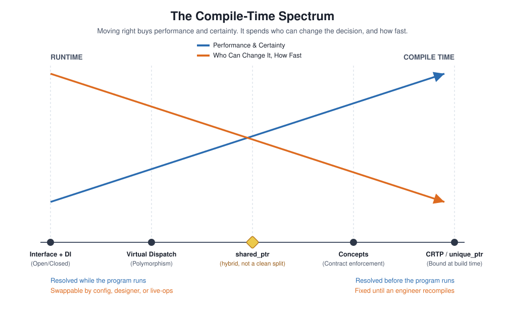
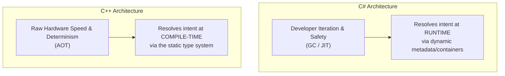

# Compile-Time Performance vs. Runtime Flexibility

Someone on the team was writing low-level, C-style code: raw arrays, manual indices, and no classes in sight. I remember the physical reaction more clearly than the code itself: **goosebumps, and not the good kind**.

Every SOLID instinct I had was screaming that this was a massive architectural regression. When I asked about it, the answer was some version of *"performance, cache lines, optimization."* My honest internal response was: *why should hardware performance stop you from writing clean, reusable code?*

I want to be precise about what that reaction actually was. It wasn't snobbery, and it wasn't really about that single file. It was the tail end of a belief I'd been carrying for years without ever stating out loud: **flexibility and performance are an absolute tradeoff, and the language you choose dictates which one you get.**

> **The False Dichotomy:** C# gives you runtime flexibility; C++ gives you execution speed. Pick your lane.

That belief is fundamentally wrong. I had to hit this wall from both directions, years apart, before I truly understood why.

---

## The Blind Spot: Mistaking a Mechanism for a Missing Capability

### The First Crossing: C++ to C#

I learned to program in C++ before C++11 was in wide use, drawn in by real-time graphics work. Every attempt to reuse code from an earlier project ran into a wall of bad practices: tangled dependencies, no clean seams, and nothing built to be extended. As a student, restarting was a minor annoyance rather than a real financial cost, so I never had reason to name what was actually missing.

The local job market eventually pushed me into C# instead, delivering an unexpected "aha" moment: **OOP done properly, with SOLID principles that had clear names and reasons attached.** Within months, I became sensitive to code smell in a way I never had been before.

What I didn't notice at the time was that C# hadn't taught me "flexibility" as an abstract property: **it had taught me one specific mechanism for it (interfaces resolved at runtime, usually wired together by a DI container).** I absorbed that mechanism so completely that it started to feel like the definition of the goal itself, rather than just one implementation of it.

### The Second Crossing: Returning to Modern C++

Years later, my second crossing back into modern C++ collided hard against those C# habits:

* References versus pointers and strict `const` correctness.
* Precise memory lifetime rules.
* Undefined behavior that failed silently instead of throwing explicit exceptions.
* Linker errors that printed pages of noise without identifying the root cause.

Systems I could draft in C# in twenty minutes took a full day to implement in C++. It was easy to read that productivity gap as proof that the language itself was the wrong call, and for a while, I did.

|Crossing|Blind Spot|Mistake|
|---|---|---|
|C++ -> C#|I don't have a framework yet|This is just how C++ is.|
|C# -> C++|I don't recognize this idiom|This language lacks flexibility.|

Neither issue was actually about the language. Both were about **which specific mechanism I had learned to associate with the design goal.**

---

## The Fix: C# Instincts vs. C++ Idioms

Unreal Engine's higher-level layers shielded my day-to-day gameplay code from most of this tension for a long time. My project [ParticleSim](https://github.com/Atimormia/ParticleSim) is where I stopped letting that engine shield stand in for an answer.

What came out of it wasn't just a benchmark: it was a list of **C# instincts I kept carrying into C++ without noticing**, each one costing real engineering time before I replaced it with the actual C++ idiom for the same goal.

### 1. Stop Reaching for an Interface First

* **The C# Reflex:** When a system needs to vary, define an interface (`IProcessor`) and inject an implementation at runtime.
* **The C++ Anti-Pattern:** Reaching for an abstract base class with virtual methods because it matches the surface-level C# syntax. This quietly introduces unnecessary runtime vtable lookups and pointer indirection for design choices that never change at runtime.
* **The Modern C++ Idiom:** Use a **template constrained by a concept**. In [ParticleSim](https://github.com/Atimormia/ParticleSim), `SoAField` plays the exact same role an interface contract plays in C#: it defines what any field type must support. However, the compiler enforces this contract *before* the program ever runs. (This leverages the same tag-struct and concept machinery discussed in [Data Layout Is Architecture](DataLayoutIsArchitecture.md)).

### 2. Stop Treating `virtual` as the Only Form of Polymorphism

* **The C# Reflex:** If behavior varies by type, write a virtual method, override it in a derived class, and dispatch dynamically.
* **The C++ Idiom:** For low-frequency gameplay logic, virtual methods are fine. But for high-frequency systems, treating `virtual` as the *only* answer forces every call site to pay an instruction cache miss and pointer lookup. Use the **Curiously Recurring Template Pattern (CRTP)** to resolve call-site polymorphism at compile time (as detailed in [the true price of a virtual function](VirtualFunctions.md)). Because the derived type is known before execution, the compiler inlines the call entirely.

### 3. Stop Treating a Missing GC as a Missing Capability

* **The C# Reflex:** Rely on garbage collection (GC) as an absolute safety net for object allocation and lifetimes.
* **The C++ Idiom:** The absence of a GC does not mean a lack of safety: **it means lifetime management shifts from runtime tracking to the compile-time type system**.
  * `std::unique_ptr` encodes single ownership directly into the type (compilation fails if you attempt an illegal copy).
  * `std::shared_ptr` provides explicit reference counting when shared ownership is genuinely required.

Neither smart pointer is a "weak substitute" for a GC. They are explicit expressions of decisions C# makes silently every time you write `new`.

### 4. Measure Before You Conclude

The most critical habit was testing architectural claims directly rather than debating them conceptually. Building targeted performance benchmarks revealed:

* A **5x to 6x performance gap** between Array of Structures (AoS) and Structure of Arrays (SoA) layouts (see [Data Layout Is Architecture](DataLayoutIsArchitecture.md))
* A massive jump in insertion throughput once the concurrency model aligned with explicit memory ownership boundaries.

---

### The Mapping: Translating Design Intent Across Languages

| Design Goal | Typical C# Idiom (Runtime) | Typical Modern C++ Idiom (Compile-Time) |
| --- | --- | --- |
| **Open/Closed Principle** | Interface + DI container (resolved at runtime) | Concept-constrained template (resolved at compile time) |
| **Polymorphic Behavior** | Virtual methods via vtable dispatch | CRTP / static dispatch (inlined by compiler) |
| **Contract Enforcement** | Interface checked at compile time, resolved at runtime | Concept satisfaction checked entirely at compile time |
| **Memory & Lifetime Safety** | Garbage collector tracking objects at runtime | Smart pointers (`unique_ptr`) encoding ownership in types |

> **Note on `std::shared_ptr`:** Smart pointers like `shared_ptr` act as a hybrid: ownership is expressed in the type, but cleanup resolves via runtime reference counting. C++ didn't reject automatic lifetime management; it simply refused to pay for it everywhere by default. This aligns with [the ownership chains I wrote about in Unreal](OwnershipTaxUE.md): the C# `?.` safe-navigation chain is a runtime safety net standing in for an ownership boundary that C++ expects you to design explicitly.

---

## The Practice: Weighing the Costs of Compile-Time Resolution

Compile-time resolution buys execution speed and deterministic safety, but it is **not a free upgrade**. Shifting logic into the compiler introduces explicit costs that must be weighed carefully.

### Build Time Is a Real Engineering Cost

Template-heavy C++ code carries a permanent compilation tax. Every template instantiation compiles separately, clean build times scale non-linearly with template depth, and binary sizes can bloat significantly. Slower compilation directly impacts daily developer iteration speed.

### Diagnostics Get Worse Before They Get Better

When a runtime call fails in C#, you receive a stack trace pointing directly to the broken line. Template errors in C++ can generate screens of substitution failures. While C++20 Concepts significantly improved this by making constraint failures read like interface mismatches, a gap in developer feedback clarity still remains.

### Compile-Time Decisions Lock Out Non-Engineers

Moving structural choices into compile-time templates fixes those decisions at build time.

An interface resolved via Dependency Injection or loaded from a data file can be swapped by a designer, modified via dynamic config, or toggled by a live-ops flag without touching code. As established in [Data-Driven Design Is an Architecture Boundary](DataDrivenDesign.md), **the deeper a decision moves toward compile time, the more it gains in hardware performance, and the more it sacrifices in operational adaptability.**

### Testability Takes More Effort

Mocking an interface for unit testing is nearly frictionless in C# because DI containers thrive on runtime substitution. Mocking a concept-constrained template or a CRTP base class requires specialized compile-time test setups, creating a higher structural barrier for automated testing.

### The Practical Balance

Applying the core message from [Tick Pitfalls](TickPitfalls.md): **evaluate what the target system specifically requires rather than relying on default coding habits.**

* **Choose Compile-Time Resolution when:** Logic is stable, operates on a hot execution path (high frame-rate or throughput requirements), and is maintained entirely by programmers who can recompile binaries.
* **Choose Runtime Resolution when:** Behavior must change dynamically without rebuilding binaries, needs to be configured by designers/non-engineers, or requires clean runtime substitution for testing.

---

## The Insight: Same Keyword, Different Default Engine

C# and C++ share enough surface syntax to create false cognates: terms that look identical across languages but map to fundamentally different default cost models.

`class`, `interface`, and `generic`/`template` look like the same structural moves in both languages. Under the hood, however, each language makes an opposing foundational bet:

* **C#'s Default Bet:** **Safety and Iteration Speed.** The Garbage Collector, JIT compiler, and runtime reflection operate under the assumption that developer iteration speed matters more than the raw CPU cycles spent securing it.
* **C++'s Default Bet:** **Zero-Cost Abstractions.** You only pay for what you explicitly request. Every abstraction must earn its runtime footprint or be completely compiled away into native assembly.

True cross-language fluency is not just about syntax memory. Recognizing an idiom in one language does not automatically teach you to spot its counterpart in another.

**Architectural design goals must be evaluated independently from the specific language mechanisms used to achieve them.**

---

## The Production Bottom Line

> **The Tool Was Never Wrong:** If a language cannot execute a pattern the way you are accustomed to doing it, that is not proof that the language lacks capability. It usually means the capability lives at a different stage in the compilation pipeline.
> * **C# resolves design intent at runtime** and hands you dynamic containers to manage it.
> * **C++ resolves design intent at compile time** and hands you a static type system to enforce it.
>
>
> Neither model is an inherent limitation; both are intentional engineering trade-offs designed for different points in the development pipeline.