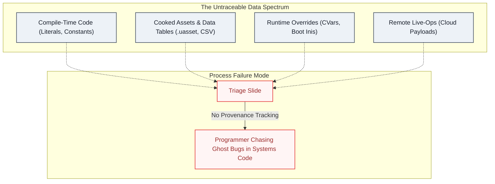

# Data-Driven Design Is an Architecture Boundary

I keep running into the same shape of bug report. An enemy's behavior looks inconsistent across sessions: sometimes it uses an aggressive attack pattern, sometimes a passive one, with no code path that should branch on anything but the encounter itself. It reads like a race condition, a bad random seed, or state bleeding between sessions. Someone reproduces it, hands it to a programmer, and the programmer spends a day chasing threading and RNG before finding the actual cause: a staged rollout percentage in a remote live-ops config, quietly assigning a different behavior variant to a different fraction of sessions.

Nothing in the code was non-deterministic. The value deciding which branch ran wasn't in the code at all.

Nobody did anything wrong here. The value was moved out of code on purpose, probably by someone applying good practice: designers shouldn't need a programmer to recompile the game to change a number from 100 to 105. That instinct is correct. But "move data out of code" is usually treated as a single decision (hardcoded or not) when in practice it's a whole spectrum of places a value can live. Most teams never decide, on purpose, which value belongs where or how anyone is supposed to find it again.

---

## The Blind Spot: An Untraceable Data Spectrum

Most treatments of data-driven design frame it as a binary: code owns behavior, data owns variation, done. That framing is true and also not very useful, because nobody actually chooses between "hardcoded" and "data-driven." They choose a point on a gradient, and the gradient is a lot deeper than it looks:

Every step down this table trades three things at once:

1. **Performance vs. iteration speed:** a literal costs nothing at runtime; a cloud payload costs a network round trip and a parse.
2. **Compile-time safety vs. designer flexibility:** a typo in a constant fails the build; a typo in a CSV fails at runtime (if it fails at all).
3. **Change ownership:** programmers hold source control, designers hold assets, and live-ops holds the backend.

None of that is new information to anyone who has worked across a few of these layers. What is missing from the usual "hardcode bad, data good" argument is what happens once a project actually has values spread across eight or ten of these layers at once. That's where the real failure mode shows up, and it isn't a technical one.

---

## The Practice: Two Ways Layering Collapses in Practice

### 1. Value Provenance Isn't Tracked by Default

When every gameplay value lived in code, "check the code" was the entire search space. That wasn't a deliberate design choice: it was a side effect of there being nowhere else to look. The moment values spread across a dozen possible layers, "check the code" stops being sufficient, and a data-layered system doesn't generate a replacement for it on its own.

This is the exact same pattern from [AI Exposes Gaps in Architecture Design](AI&ArchitectureSkills.md): a piece of friction was quietly doing a job nobody assigned to it, and removing the friction removes the job along with it. There, the compile step was accidentally enforcing architectural discipline. Here, "everything lives in one place" was accidentally providing a map.

Once data spreads out, tracing a behavior back to its source of truth has to become a deliberate part of the architecture, or a bug that's actually a stale CSV row or a misconfigured remote flag turns into an hour or more of reading systems code that was never wrong.

### 2. Escalation Defaults to the Deepest Layer

The second pitfall is subtler, and a documented ladder of layers doesn't remove it on its own. Even on projects where the config file, the data table, and the CVar are all findable, tickets still tend to route to a programmer first, regardless of which layer actually holds the answer.

The reason is trust, not difficulty. A layer can be checked and ruled out at any point in the ladder (a table value confirmed correct, a boot config confirmed clean), but that verdict doesn't automatically close the ticket unless the process explicitly says it can.

Without an explicit rule, only a programmer's answer is treated as final, so triage keeps sliding to the bottom of the ladder no matter how inspectable the layers above it are. That means a layered system can be technically sound (every value has a documented home, every home is inspectable) and still collapse in practice, because the ownership axis was never backed by a process rule that gives it standing. A layer needs governance behind it, not just a place to live.

---

## The Fix: Design the Boundary, Make It Discoverable, Grant Standing

### 1. Choose the Layer on Purpose

Before a value gets externalized at all, it's worth asking three questions instead of defaulting to whatever layer is closest at hand:

* **Change frequency:** does this move once a year, once a sprint, or mid-session?
* **Blast radius:** if this value is wrong, who notices, and how badly?
* **Required owner:** does this need to be changeable by a programmer, a designer, or live-ops, without waiting on anyone else?

A value that changes once a year and only a programmer ever touches belongs at layer two or three, not layer nine. Pulling it further down the table doesn't make the codebase more data-driven in any way that matters: it just adds a runtime lookup, a parsing step, and one more place a bug can hide, for flexibility nobody is using.

This is the same move as [Data Layout Is Architecture](DataLayoutIsArchitecture.md): the decision isn't "data-driven is correct," it's deciding the shape per value, behind a boundary, instead of defaulting the same way every time.

### 2. Make the Choice Discoverable

Choosing the right layer solves nothing if the choice isn't recorded anywhere a QA lead or a new programmer can find it without already knowing the system. Two concrete options, neither expensive:

* **A provenance convention:** log or surface, at the point a value is actually used, which layer it resolved from. A debug overlay that says `MaxSpeed = 42.5, source: Weapons.csv, row 12` turns a systems-code dive into a five-second lookup.
* **A discoverable registry:** one page or one file mapping gameplay-visible behaviors to where their values actually live. It doesn't need to be exhaustive on day one: it needs to exist and be the thing people are pointed at instead of Slack history.

This is the same idea as the documentation mechanism in [Code Review as Architecture Governance](CodeReview.md): a record that outlives whoever wrote it, so the next person does a lookup instead of archaeology.

### 3. Give Non-Programmers Standing to Close the Loop

Discoverability fixes the search problem, but it doesn't fix the trust problem. If a producer checks the CSV, finds it correct, and still can't close the ticket without a programmer's sign-off, the ladder is decorative.

Standing has to be given deliberately, not assumed: a triage convention where "ruled out at layer X" is treated as a real, closing answer unless something specific reopens it, not a placeholder waiting for a programmer to confirm. That's a process decision, not a technical one, and it's the harder half of the fix, because it means trusting a verdict from someone whose job title isn't "programmer."

---

## The Insight: Credit the Case, Track the Pattern

Even with all three pieces of the fix in place, tickets will still land on a programmer's desk when they didn't need to. Deadlines get tight, leads are new, producers are stretched thin, and every one of those has a real reason behind it that I usually can't fully see from where I sit. I've learned to give that benefit of the doubt case by case: once, twice, a handful of times, that's just how production goes.

What I've settled into as my own approach is this: **the individual case gets credit, but the pattern across cases doesn't get to stay invisible.**

If the fourth escalation this quarter is something the data table would have answered, that's a data point about the system, not about the person who escalated it. It's worth asking what part of that is actually mine to change: maybe it's documentation, maybe it's moving where a value lives, or maybe it's just making the pattern visible to someone who can act on it instead of quietly absorbing another hour.

That last part is a judgment call more than a process, and it's a personal one: how long to sit with a repeated signal before raising it, and whether there were cheaper options to try first (a provenance log, a registry entry, a conversation) before treating it as something that needs escalating past your own desk. I don't think there's a clean formula for that threshold.

It's closer to the same instinct from [The Invisible Rebuild Bottleneck](SilentBuildProblem.md): noticing which layer of a recurring cost is actually yours to fix, rather than either ignoring it or trying to fix everything upstream of you.

---

## The Production Bottom Line

> **A Spectrum Needs a Map, Not Just Layers:** Moving a value out of code was never the whole decision. Data-driven design only pays off when three things are chosen on purpose instead of defaulted into: which layer a given value actually belongs on, how anyone traces a behavior back to that layer without already knowing the system, and whether the people closest to that layer are trusted to close the loop themselves.
>
> Miss any one of the three, and the spectrum doesn't disappear: it just quietly routes every unknown case to the person holding the deepest layer, whether or not that's where the answer actually lives.