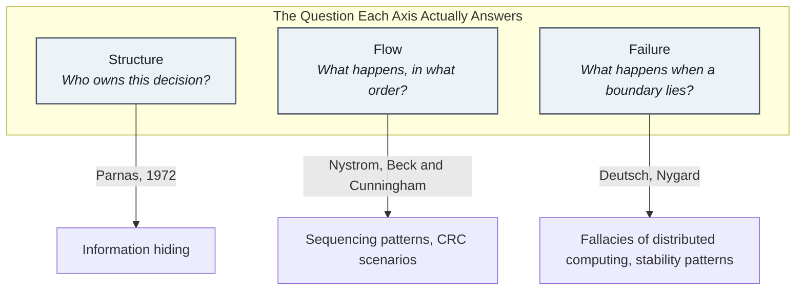
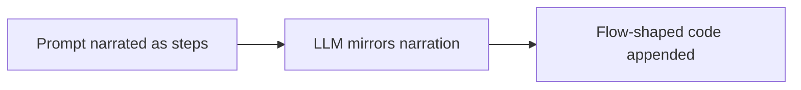

# Decomposition Is a Judgment Call

I have watched the same shape of codebase rot more than once, and it never looks like negligence. Every individual patch is reasonable. Every engineer touching it can explain their change in one sentence. And yet, eighteen months later, the same file has become the place nobody wants to be assigned to: sprawling, load-bearing, and impossible to follow without reading every patch that ever landed on it in chronological order.

The honest question is not why people wrote bad code here. It is **why every reasonable patch made the same file worse instead of better**. That question does not have a discipline answer. It has a decomposition answer.

---

## The Blind Spot: Narration Chooses for You

Ask a room of engineers whether decomposition is a deliberate design decision and most will say yes, of course. Watch the same room start a new feature and the behavior tells a different story.

Someone describes what the feature needs to do: first this happens, then this gets checked, then this gets applied. The code that gets written mirrors that description almost exactly (one function per step, in the order the steps were narrated). Nobody sat down and chose to decompose the system that way. **The decomposition just fell out of how the problem was explained out loud.**

This pattern is older than most of the tools we use to write code. David Parnas, in a [1972 paper on module decomposition](https://fermatslibrary.com/s/on-the-criteria-to-be-used-in-decomposing-systems-into-modules), drew this exact contrast between two approaches:

1. **Step-based decomposition:** Drawing a module boundary around each processing step in execution order. This is what engineers reach for by default, because it matches how a human narrating a workflow solves a problem.
2. **Decision-based decomposition:** Drawing a boundary around each design decision that is likely to change later, hiding it behind an interface so revisions never ripple outward into unrelated steps.

Parnas demonstrated that the second approach holds up far better over time. A module built around a processing step has no natural home for decisions that step never anticipated.

It is tempting to conclude that structure decomposition simply wins every time (that we should always draw boundaries around ownership). But that conclusion collapses when it meets a second insight from the same academic lineage: [the tyranny of the dominant decomposition](https://arxiv.org/pdf/1201.5230).

**Whichever axis you pick to organize a system becomes dominant, scattering every concern that does not align with that axis.** If you pick structure as your sole axis, execution order scatters. A system decomposed purely around ownership produces components that are individually pristine, yet collectively impossible to sequence correctly, because nothing in the structure governs what must happen before what.

That is the actual blind spot: **decomposition has more than one legitimate axis, each catching a different category of mistake, and almost nobody treats choosing an axis as an active decision.**

---

## The Fix Axes: Structure, Flow, and Failure

Three decompositions, each backed by real prior art, each answer a question the other two structurally cannot address.

### 1. Structure Decomposition

*Answers: "Who owns this decision?"*

Parnas's information hiding is the founding model: a module encapsulates a decision likely to change, placing everything that decision touches behind an interface. This axis governs far more than class hierarchies:

* **Representation:** Deciding how data lives in memory (an array of structures versus a structure of arrays) is a structural choice. [Data Layout Is Architecture](DataLayoutIsArchitecture.md) illustrates what happens when memory layout is selected intentionally behind a stable interface rather than inherited by default.
* **Lifecycle:** Who creates state, who validates it, and who deallocates it are structural questions before they ever become performance concerns. [Garbage Collector Spikes](GarbageCollection.md) examines the profiler symptom of an unowned lifecycle: an object remains reachable simply because nobody was assigned to end its life.
* **Reference Stability:** Deciding who keeps a live reference valid as the underlying target changes. [Ownership Tax in Unreal Engine](OwnershipTaxUE.md) shows the symptom of skipping this question under time pressure: four consecutive hops of `IsValid()` checks reaching through objects nobody actually owns.

### 2. Flow Decomposition

*Answers: "What happens, and in what order?"*

Flow decomposition deserves equal status rather than being treated as structure's sloppy cousin. In [Game Programming Patterns](https://gameprogrammingpatterns.com/update-method.html), Robert Nystrom separates sequencing patterns (the game loop, the update method) from decoupling patterns as coexisting architectural layers.

Flow decomposition has its own verification discipline: [CRC cards, from Beck and Cunningham](https://c2.com/doc/oopsla89/paper.html), walk a concrete scenario through a candidate design by hand, treating every snag in execution as a missing responsibility to fold back into the structure.

Structure without flow verification is just as incomplete as flow without structure underneath it. [The `Tick()` Pitfalls](TickPitfalls.md) demonstrates a case where the flow question (what happens every frame) was answered correctly, while the structural question (who should own waking this actor up) was never asked at all.

### 3. Failure Decomposition

*Answers: "What happens when a boundary stops behaving as assumed?"*

Failure decomposition addresses scenarios that structure and flow leave entirely uncovered. [Peter Deutsch's fallacies of distributed computing](https://lasr.cs.ucla.edu/classes/188_winter15/readings/fallacies.pdf) catalog the invalid assumptions baked silently into software: that networks are reliable, latency is zero, and bandwidth is infinite.

[Michael Nygard's stability patterns](https://pragprog.com/titles/mnee2/release-it-second-edition/) (timeouts, circuit breakers, bulkheads) provide the architectural response. These patterns do not alter who owns what, nor do they reorder the normal sequence. They assume structure and flow are already correct, and resolve what happens when a dependency is neither clearly present nor clearly gone.



None of these axes require novel programming syntax. Writing a class, writing a sequence, or setting a timeout are all straightforward. **The real engineering judgment lies in noticing which axis a task is quietly defaulting to before that default hardens into the codebase.**

---

## In Practice: Task Defaults and Gaps

### New feature

New feature work defaults to flow. Because a feature is narrated chronologically before structure exists, narration becomes the path of least resistance. In [The `Tick()` Pitfalls](TickPitfalls.md), the aura actor's per-frame execution was answered immediately, but because narration never naturally introduces the question of ownership, waking the actor up remained unowned.

### Bug fixes

Bug fixes default to flow even more aggressively. A procedural patch is usually one line away, whereas a structural fix requires defining a relationship that does not yet exist:

> I once tracked down a bug where balance data parsed correctly on every machine except mine. The root cause was a third-party library reading numeric strings against the host OS locale, and my system used a comma as a decimal separator instead of a dot.
> The tempting patch was a flow fix: detect the locale, branch on it, and ship. But the real defect was structural: determining which decimal separator to expect is an explicit design decision (Parnas's exact criteria: a decision likely to vary). Because nobody owned that decision, it fell through to ambient environment state. The true fix was not an ad-hoc branch, but an explicit, owned parsing policy decoupled from the OS.

### Refactor

Refactors default to over-applying structure. The judgment call in a refactor is identifying which layer's decomposition actually broke, rather than adding interfaces everywhere. [Refactoring a Legacy System at a Critical Point](RefactoringCase.md) traces a four-layer compensation chain:

* UI markup hardcoded logic because the underlying layer offered no declarative hook.
* A Blueprint graph hardcoded dependencies because the class below lacked an extension point.
* A monolithic settings class absorbed everything because of the shape it inherited.

The naive reaction is to restructure all four layers. A decomposition-literate approach is narrower: fix the single layer whose decomposition axis failed, and the compensations above it dissolve. Over-structuring the entire chain merely relocates complexity instead of eliminating it.

### Incidents

Incidents expose failure decomposition. Incidents frequently occur when structure and flow are both entirely correct. Consider a live-service game fetching event configuration on boot, blocking the loading screen because the call typically resolves in under 200 milliseconds:

```cpp
// Naive: no timeout, no backoff. "Slow" and "gone" resolve identically:
// the player waits indefinitely.
Request->OnProcessRequestComplete().BindLambda(
    [this](FHttpRequestPtr Req, FHttpResponsePtr Resp, bool bSucceeded)
    {
        if (!bSucceeded || !Resp.IsValid())
        {
            FetchLiveOpsConfig(); // Immediate retry storm during backend degradation
            return;
        }
        ApplyLiveOpsConfig(Resp->GetContentAsString());
        ProceedToMainMenu();
    });
```

Neither ownership nor sequencing failed here: fetching before showing the menu is correct. What failed was the missing failure axis: assuming the network is reliable and latency is bounded. During traffic spikes, the backend degrades rather than crashing, and immediate retries amplify the outage into a self-inflicted denial-of-service.

Notice the second architectural leak in that naive snippet: the HTTP callback directly invokes `ApplyLiveOpsConfig` and `ProceedToMainMenu`. The network layer is deciding UI state transitions. That is a flow leak inside failure-handling code.

The resilient fix isolates failure policies into their own component and hands flow control back to the caller:

```cpp
// The network layer's sole job: resolve config via success, cached fallback, or failure.
// It has no awareness of UI or scene navigation.
DECLARE_DELEGATE_OneParam(FOnConfigResolved, const FLiveOpsConfig&);

void ULiveOpsConfigFetcher::FetchConfig(FOnConfigResolved OnResolved)
{
    if (CircuitBreaker.IsOpen())
    {
        OnResolved.Execute(GetCachedOrDefaultConfig()); // Bulkhead
        return;
    }

    Request->SetTimeout(TimeoutSeconds); // Bounded wait
    Request->OnProcessRequestComplete().BindWeakLambda(this,
        [this, OnResolved](FHttpRequestPtr Req, FHttpResponsePtr Resp, bool bSucceeded)
        {
            // BindWeakLambda: if the fetcher is destroyed mid-flight,
            // execution aborts cleanly without accessing dangling state.
            if (!bSucceeded || !Resp.IsValid())
            {
                CircuitBreaker.RecordFailure(); // Circuit breaker
                if (CircuitBreaker.IsOpen())
                {
                    OnResolved.Execute(GetCachedOrDefaultConfig());
                    return;
                }
                RetryWithBackoff(OnResolved);
                return;
            }
            CircuitBreaker.RecordSuccess();
            OnResolved.Execute(ParseConfig(Resp->GetContentAsString()));
        });
    Request->ProcessRequest();
}
```

```cpp
// The loading screen subsystem governs sequencing.
// It remains completely agnostic of HTTP details and circuit breakers.
void ULoadingScreenSubsystem::BeginLoadingSequence()
{
    ConfigFetcher->FetchConfig(FOnConfigResolved::CreateWeakLambda(this,
        [this](const FLiveOpsConfig& Config)
        {
            ApplyLiveOpsConfig(Config);
            ProceedToMainMenu();
        }));
}
```

The fetcher does not know what a menu is, and the loading screen does not know what a circuit breaker is. By decoupling the failure policy from the sequence, each axis remains contained within its own boundary.

---

## The Insight: Architectural Rot, AI, and Static Snapshots

A flow-decomposed system does not rot because engineers are careless. **It rots because there is structurally nothing for a new patch to be validated against.**

* A **structure-decomposed** system gives a patch somewhere to fail cleanly: it either conforms to an established interface or it visibly breaks contract.
* A **flow-decomposed** system leaves an engineer with only one viable move: append code to the nearest procedural step.

This mechanical decay matches the governance pattern highlighted in [Code Review as Architecture Governance](CodeReview.md): whatever standard is not explicitly named is the standard that quietly stops being enforced.

This same mechanism explains how generative tooling impacts software design, driving one level deeper than [AI Exposes Gaps in Architecture Design](AI&ArchitectureSkills.md):



AI does not choose architectural decomposition; it inherits the axis implied by the prompt. When a task is explained conversationally ("first do this, then check that"), the model generates procedural, flow-dominant code by default. If a team lacks the habit of selecting decomposition axes deliberately, AI simply generates the unexamined default at scale.

Finally, even naming all three axes does not eliminate all architectural risk. Every decomposition is a snapshot taken with the information available at the time. A stat-calculation pipeline can become a major runtime bottleneck not from a bad design decision, but because five reasonable layers interact at an execution frequency nobody could foresee when those layers were separated.

Decomposition is an active judgment call, not an upfront guarantee. Systems require continuous profiling and structural revision as runtime conditions shift.

---

## The Production Bottom Line

> **Every task quietly defaults to whichever axis narration makes easiest to reach:**
> * **New features** default to **Flow** (the narrative is known, but the ownership is not yet structured).
> * **Bug fixes** default to **Flow** (the procedural patch is one line away).
> * **Refactors** default to over-applying **Structure** (adding interfaces feels like the responsible choice).
> * **Incidents** expose missing **Failure** decomposition (the happy path was sequenced, but degradation was ignored).
>
> Software does not rot because engineers lose discipline. It rots because nobody decided which axis a decision belonged to, allowing the architecture to default to the easiest cognitive path, patch after patch, until the system became the sum of a hundred convenient shortcuts instead of deliberate choices.