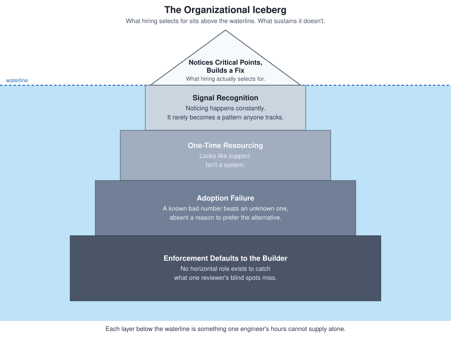

# The Engineer-Process Boundary

Refactoring a rotten system on limited resources (the story told in [Refactoring a System at Critical Point](RefactoringSystemAtCriticalPoint.md)) took real engineering judgment. It turned out to be the trivial part of the solution.

I built the skeleton. I documented it, presented it to the team, and walked through my exact implementation multiple times. I did everything a line engineer is positioned to do to move a migration forward.

Then the tickets kept arriving: more over time, not fewer. Some were ordinary settings bugs, but a growing share traced back to patches quietly leaking into the old system (the exact one I had already built and proven a safer path around).

**Building a working fix and providing a documented, low-risk path should have been the hard part. It wasn't.**

The migration didn't happen.

---

## The Blind Spot: Where the Signal Actually Goes

I wasn't the first person to notice this system was rotten. Going through the codebase archaeology for the refactor, I found other people's fingerprints everywhere: a local validation improvement here, a half-written internal doc there, a structure in one corner of the codebase reaching for something bigger. Nobody had built what I built, but several people over several years had tried to build something like it. Every attempt stalled in roughly the same place mine eventually did.

The failure breaks down into four distinct stages:

### 1. Signal Recognition Without Accumulation

**Signal recognition isn't rare.** It happens constantly and quietly, one engineer at a time, whenever someone notices a system is worse than its ticket implies. What is rare is for individual signals to accumulate into something the organization registers as a pattern. Each attempt looked, from the outside, like an isolated decision to go the extra mile. None of them looked, to anyone with the authority to act, like a systemic problem repeating itself.

### 2. The False Sense of Resolution

When a signal is finally heard (as mine was), a false sense of resolution sets in. My tech lead agreed the system needed work, but provided no timeline, no dedicated support, nothing beyond an informal blessing to keep going without either.

That felt like a reasonable response. It answered the immediate question (*"can this person keep going?"*) without answering the real one: **does this system have anything protecting it once this person stops?** A one-time nod closes the ticket. It does not change what happens the next time the system needs attention.

### 3. The Asymmetric Pricing of Risk

I ran the new skeleton in parallel with the old system, migrating one category at a time, so nobody had to trust an unproven system on faith. That should have removed the main barrier to adoption, but it didn't remove all of it.

Engineers weren't choosing the old system because they doubted the new one worked. **They were choosing it because its failure rate was already known and priced in.** Bugs from the old settings code were a familiar, budgeted cost. Bugs from a new system were an unknown cost. Given a choice between a known bad number and an unknown one, most people will take the known number even if it is worse on average.

> Proving the new path was safe made it provably safer. It didn't make it feel cheaper than staying put, and cheaper is what actually moves day-to-day behavior.

### 4. Vertical Roles vs. Horizontal Architecture

My role, like every line engineer's role on that project, ran vertically: attached to a feature, working with designers and producers to ship a specific slice of the game. Nobody's role ran horizontally across the technology stack, responsible for whether the underlying architecture was getting better or worse over time.

When a structural boundary problem needed someone to track and enforce a fix, there was no seat built for the job. It defaulted to whoever happened to be standing closest: me. But a single vertical role, however conscientious, can only see the drift that happens to cross its own code reviews. **A vertical role has a hard ceiling on how much horizontal drift it can catch.**

Four stages, and only the first one is visible from the outside. Noticing a critical point is a trait hiring can select for ([How to Hire Engineers When Syntax Is Free](TechInterview.md)). It cannot hire its way out of the organizational blind spots that follow.

---

## The Phantom Fix: Mandate It From Above

The tempting answer to these four stages is to solve stage four with top-down authority: give a tech lead or architect the standing to require migration instead of merely inviting it. Make it part of the Definition of Done. Attach it to a deadline.

This is tempting because authority feels like an accessible lever. Funding three engineers to sit on platform architecture full-time wasn't going to happen, but requiring adoption costs nothing extra on paper. It directly targets the enforcement gap.

**It also doesn't work.** Mandated internal tools have a well-documented failure pattern:

* Teams comply on paper while routing around the requirement in practice.
* Engineers quietly patch the old system to meet immediate feature deadlines.
* Two versions of the same logic remain alive indefinitely (technically migrated, functionally abandoned).

A mandate decides who has to say yes, but it does nothing about *why* saying yes costs more than saying no. Authority without structural support produces superficial compliance right up until someone checks.

---

## The Practice: What Process Could Supply

### Proving the Risk First

The parallel-run decision from the refactoring post turns out to matter more here than it did there. At the time I made it, it was a scoping call: don't force a full cutover onto data I hadn't reconstructed yet. In hindsight, it was doing something deeper. Letting the old system keep running while the new one proved itself against real graphics settings meant nobody had to take my word for whether the skeleton actually worked. They could watch it. That is the correct first move against the exact hesitation people had, and I had made it before I fully understood why it mattered.

What it didn't do (because it wasn't designed to) was make the new path cheaper to choose than the old one. **Proof reduces doubt; it doesn't create an incentive.** Those are two different jobs, and I had only ever built the tool for the first one.

### Workaround Couldn't Help Twice

The archaeology and the build were, in the end, a problem one person could solve given enough time and enough patience for reconstructing what nobody had written down. That's the core premise of the refactoring story: a defensible middle position existed between jamming the change in and running the full textbook sequence, and a single engineer could locate it and build it.

Migration adoption doesn't offer that same middle ground because what is missing isn't information I could reconstruct or judgment I could apply. It is other people's time, and there is no clever individual workaround for spending time that belongs to someone else. **I could out-think a missing map; I couldn't out-think fifteen other engineers, each weighing their own roadmap against a migration nobody was requiring of them.**

### Why Nobody Else Made the Same Bet

There is a harder version of this point worth not skipping past. From where I sat, investing real effort in graphics made sense: I had already sunk two weeks into archaeology, I could see exactly where the rot lived, and building the skeleton on top of what I had learned cost me less than it would ever cost anyone starting fresh.

From any other line engineer's seat, none of that held. Migrating their category meant paying a cost nobody had assigned them, on a responsibility that existed nowhere in writing, backed by no guarantee the organization would ever recognize the investment, let alone fund the next one.

Staying on the old system wasn't laziness wearing caution's clothes. **It was the better bet.** A known system, quietly getting worse, is exactly the kind of cost that eventually gets expensive enough that leadership has to notice and pay for a real fix. Granting more time doesn't build toward that pressure: it releases it.

This is the exact same coping-mechanism shape seen in [Ownership Tax in Unreal Engine](OwnershipTaxUE.md) and [The Invisible Rebuild Bottleneck](SilentBuildProblem.md), just running through me this time instead of through someone else's `IsValid()` check or someone else's productive-looking wait during a rebuild. **Diligence that quietly absorbs a systemic cost is what stops anyone from asking why the cost exists**, whether that diligence lives in a line of defensive code or in one engineer quietly carrying a cost nobody assigned them.

### Making the Next Category Cheaper, Not Just Possible

Once that distinction was clear, the actual question stopped being *"How do I convince people?"* and became **"What would make the next category cost less than graphics cost me?"** Two distinct investments fall under that, and neither one is optional if the other is missing:

* **Tooling (Friction Reduction):** Engineering work that lowers the raw hours a migration takes, regardless of who ends up doing it. This means an automated validation pass comparing old-system and new-skeleton behavior, alongside scripts that surface where a given category's cvars, class fields, and Blueprint hooks live. None of that got built, because building it would have taken more time on a project that was already costing more time than anyone had signed off on.
* **Organizational Support (Resourcing):** Support isn't the same thing as permission. Permission is what I already had. **Support means migration work actually appearing in a planning cycle with a line item attached**, so the next engineer picking up a category isn't choosing between architecture health and their primary feature roadmap. They are doing both because both are now visibly the job, not because they were asked to quietly absorb it on the side.

### Why the Bottleneck Never Moved

Here is the part that only became obvious in hindsight. Support for the original build was local from the very first conversation: figure it out yourself, keep everyone else's calendar unchanged. Nothing about that arrangement contained a reason it would look any different once the build was done and migration started. The organizational default doesn't reset at the next stage just because the stage changed. It carries forward exactly as it was until something outside the person doing the work actively changes it.

I hit that same bottleneck a second time in a different shape, and there was no detour around it. Detouring around it the first time relied on the only lever available to an individual line engineer: doing more of the work myself. **That lever doesn't work on other people's calendars**, and no amount of engineering judgment on my end was ever going to make it work.

---

## The Insight: A Signal Is Not a System

Signal recognition, honest scoping, and proof of safety are all deliverables a single engineer can produce through persistence. What an individual cannot produce alone is the other side of the boundary: **standing authority paired with standing resources.**

It is tempting to read this outcome as a discipline failure (either mine for not pushing harder, or the team's for not caring enough). It was neither. The team's hesitation to take on an unassigned, unresourced responsibility was the correct operational decision.

Being capable enough to quietly absorb a system's failures is not automatically the responsible move.

> Sometimes the most valuable thing a senior engineer can do isn't finding a clever workaround at all. It is recognizing that a workaround, however capable the person building it, hides the problem from the people who could actually fund a solution, and choosing, deliberately, not to absorb the cost.

This is not sabotage or withheld effort. It's a distinct move worth naming on its own: **transparent risk surfacing.** The job isn't to go quiet, and it isn't to go silent out of frustration either. It's to put the risk on record, in writing, before it materializes, specific enough that when the system does eventually fail loudly, the failure reads as exactly what it is: a known, flagged cost the organization chose not to fund, not a surprise, and not a mark against whoever raised it first. The paper trail is what separates this from recklessness. 

Quietly absorbing the cost protects the organization from ever seeing the bill. Saying nothing protects no one, least of all the engineer who gets asked afterward why they didn't say something. Transparent risk surfacing sits in between: documented, specific, and impossible to pin on the person who wrote it down.

A signal is not a system. Neither is one engineer quietly absorbing a cost while the four other people who tried this before them stay invisible to anyone who could have connected their attempts to mine.

---

## The Production Bottom Line

> **Prove It, Then Fund It:** An engineer who identifies a critical failure point and builds a working fix has demonstrated strong technical capability, but that is only half the problem. Mistaking a working prototype for a completed migration is how good solutions end up abandoned. 
> 
>What was missing was not more engineering diligence. It was two structural prerequisites: friction-reducing tooling that lowers the raw cost of adoption for whoever comes next, and standing organizational investment that doesn't expire the moment the initial engineer moves on. Hiring someone who spots critical failure points is only the visible tip of the iceberg. The organization still has to build and fund the support structure underneath it. 
> 
>Sometimes the most senior move available isn't building that support alone, it's transparent risk surfacing: putting the risk on record, in writing, and letting it stay visible and unaddressed long enough that funding it becomes leadership's problem instead of a fix nobody asked for. Done on the record, that isn't a career risk. It's the one move that keeps the failure from ever being quietly pinned on whoever noticed it first.