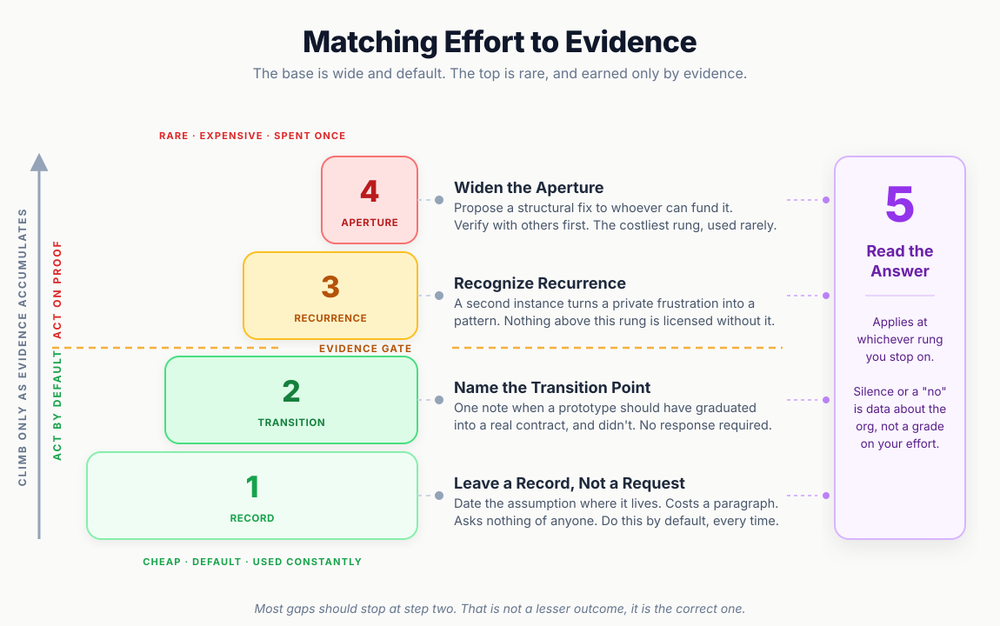

# Matching Effort to Evidence

A newly formed core team owed us a plugin: a wrapper around a third-party library that game engineers could build UI on top of. Before I was even staffed on the feature, the plugin I inherited was already copying the entire backend interface (every field, every method) just in case. Nobody had decided what the game side actually needed. The interface conversation had stalled, so someone filled the silence the only way available: **mirror everything and figure out the real shape later**.

That instinct wasn't inherently wrong. Iterating against a fast, disposable copy to discover real requirements is a legitimate way to get unstuck when boundaries aren't clearly drawn. The problem showed up on the other side of that trade. Nobody had the context to design a general interface, not even whether a second game would ever consume this plugin, so mirroring the backend was the only way to keep moving, and it locked the interface's shape early, around whatever one game happened to need at the time. That lock cut the refactoring room core would have needed to generalize later. Instead of building something game-agnostic once, they spent the next stretch of time patching the same plugin to fit each new game's requirements individually: not a shared solution anymore, just a backend team doing bespoke integration work under a different title.

---

## The Blind Spot: Purpose Without Process

The core team's underlying purpose was clear: centralize solutions across multiple games so teams didn't reinvent the wheel. What was missing was the operational mechanism. Nobody had decided whether generalization was supposed to flow upward (a game builds a feature, a second use case emerges, core adopts it) or downward (core designs a game-agnostic system from scratch and hands it down). There was no dedicated manager attached to the team either, only senior engineers carrying an informal mandate. **A team can have a clear purpose and still lack a charter** if no one defines how it operates. Still better than no attempt at centralizing at all. Just a smaller win than the team's name implied.

Two silent workarounds filled that gap, neither of which registered as a crisis (which is precisely why it persisted). On the core side, the engineer building the plugin was guessing at the interface by mirroring backend components without a design conversation. On my side, I was writing Jira tickets for an unplanned feature and improvising process on the fly to cover cross-team gaps, because leaving it unmanaged meant work stalled completely.

Neither of us stayed inside our assigned lanes. When waiting for the other side created a bottleneck, we bypassed it. He patched game code directly; I wrote Go scripts against the backend. We didn't break boundaries out of carelessness, but because **respecting an undefined boundary meant standing still**, which wasn't an option under tight deadlines.

At the time, neither of us realized we were solving the exact same problem from opposite sides. Two engineers on different teams were independently absorbing a missing coordination function, crossing into each other's territory to keep progress alive. From the outside, this should have been a loud organizational signal: **if two engineers are continuously crossing a boundary to keep a project moving, that boundary was never actually drawn**. Instead, it looked like two people doing their jobs well. The structural gap dissolved into silent effort rather than becoming actionable evidence.

---

## The Fix: Escalating on Evidence vs. Emotion

The natural reflex when encountering an organizational gap is to push harder: build more, document more, and present the case with greater urgency. That instinct is what pushed both of us into unplanned overtime for an unscoped feature. Yet overworking doesn't solve structural gaps on its own, because **an organization won't fund a dedicated architecture role simply because an engineer worked hard enough to deserve one**.

The critical question isn't how to force a change, but **what the available evidence actually justifies doing**. I eventually submitted a formal proposal to company leadership for a chartered architect role (complete with a specific candidate in mind) after confirming across multiple teams that this wasn't an isolated issue. That is the most expensive move available to a line engineer. A year later, a similar role was created and filled by someone else. By that point, I had already transitioned to another project and never saw the outcome.

If success is defined strictly by whether leadership acts on your exact recommendation, this result looks like a failure. But that is the wrong metric. The response answered a fundamental question: **what are the organization's real priorities?** Through a year of silence followed by an independent decision, the organization signaled where its focus actually lay.

Escalating at all costs is not the takeaway here. **The cost of an escalation must match the weight of your evidence, not the intensity of your frustration.** This is the same instinct behind [Refactoring a Legacy System at a Critical Point](RefactoringCase.md): the textbook response assumes resources that were never funded, and the senior move is finding the achievable version of correct within real constraints, not the ideal one. An escalation ladder makes that concrete: not a checklist to complete, but a framework to match effort to evidence and know when to stop.

---

## The Practice: An Evidence-Gated Escalation Ladder

### 1. Leave a Record, Not a Request

The lowest rung costs almost nothing. When inheriting the mirrored plugin, the right move was adding an explicit note to the ticket: **this is a placeholder to unblock progress, not a designed contract**, while explicitly listing what remained undecided. This isn't a request for process; it is a dated, factual record that future engineers (or your future self) can reference during code archaeology. It costs nothing and carries zero organizational risk.

### 2. Name the Transition Point Once

At a certain point, a temporary mirror needs to graduate into a formal contract. That transition point is rarely stated explicitly. The goal at this stage isn't to build the proper abstraction alone on your own time (which simply repeats the problem of absorbing unowned work). Instead, state the reality clearly to the owner of the plugin: **the placeholder served its purpose, requirements are now clear, and a proper contract is needed before expanding scope**. Say it once, on record. If no action is taken, that inaction becomes part of the documented record without burning your personal capacity.

### 3. Recognize Recurrence Before Escalating

This is the essential gate that separates personal frustration from a systemic issue worth spending capital on. The first time an abstraction failure causes unplanned work, it is an isolated boundary issue. The second time (such as when a new game's authentication requirements completely fail to fit the interface), it becomes **a repeatable pattern**. Recognizing that the core engineer was guessing at requirements from his side mirrored my own experience: **the gap wasn't specific to one feature, but reflected a systemic organizational state**.

Recurrence does not require permission to observe, but it is the required prerequisite for the next rung. Without verified recurrence, escalation is merely personal opinion masquerading as evidence.

### 4. Widen the Scope

This is the high-cost move: proposing a structural fix to leadership rather than documenting local boundaries. Before drafting a proposal, consult engineers across other teams specifically to test whether you are missing key context (not merely to recruit allies). Spending your political capital on an unverified gap is a high-risk gamble: well-intentioned, but betting your own standing instead of leveraging organizational data.

This step should be reserved strictly for issues that clear Rung 3: **verified recurrence corroborated across multiple domains**.

### 5. Evaluate the Response as Raw Data

Whatever response returns (a rejection, silence, or a resolution executed without your involvement) is not a judgment on your competency. It is **objective data about organizational priorities**. The proposal didn't fail due to poor framing; it remained unaddressed because leadership was focused elsewhere.

This evaluation applies inward as well. Documenting a stalled initiative with enough rigor to explain it clearly is often the only way to evaluate your own actions objectively. It is easy to assume you didn't push hard enough. However, structuring the evidence often reveals the opposite: **stopping when you did was the correct choice, and what felt like failure was actually healthy restraint**.

---

## The Insight: The Ladder Isn't Built to Be Climbed

The ultimate objective of an escalation ladder is not to reach the top rung. Rungs 1 and 2 are low-cost defaults that should be used routinely. Rung 3 is the critical evaluation point where **evidence (not emotion or effort) determines whether further escalation is justified**. Most organizational friction should stop at Rung 2 and never become a formal executive pitch. Stopping early is not a failure; it is the correct, calibrated response to the available evidence.

Advice on this topic frequently focuses on how to write a compelling escalation, while ignoring how to interpret the outcome. An organization that lacks a dedicated technical strategy will not magically fund one simply because an engineer asks clearly. What remains under your control is **refusing to burn yourself out substituting for missing organizational capacity**, and refusing to mistake organizational inaction for personal failure. This principle aligns closely with the ideas in [The Engineer-Process Boundary](EngineerProcessBoundary.md): pacing your investment, rung by rung, before a bottleneck leads to burnout.

There's a version of Rung 4 that goes differently: leadership actually says yes. That outcome isn't automatically the relief it looks like. A company that has been quietly relying on individual engineers to plug an organizational gap doesn't necessarily hand that gap, once acknowledged, to someone with the standing or the resources to close it. It can just as easily hand it to whoever raised it first, since that person has already demonstrated they'll carry it. A structural role created without the funding, staffing, or authority that made the original ask reasonable doesn't close the gap. It just makes carrying it official, with even less room afterward to say the resources still aren't there. Escalating is still worth doing on the evidence the ladder describes. It's just worth knowing, going in, that a yes is not automatically the safer outcome.

---

## The Production Bottom Line

> **Match the Climb to the Evidence:** An organization without a chartered function will not fund it simply because an engineer works hard enough to compensate for it. You control how much energy you invest in bridging the gap, and how accurately you interpret the organization's response, including what it costs you if the answer turns out to be yes. Leave a low-cost record by default. Name transition points once. Require clear recurrence before spending real political capital. When an answer arrives (even in the form of silence), treat it as data about organizational priorities, not a performance grade. Stopping at an early rung because evidence didn't justify going further isn't giving up: **it is the exact reason to build an escalation ladder in the first place**.