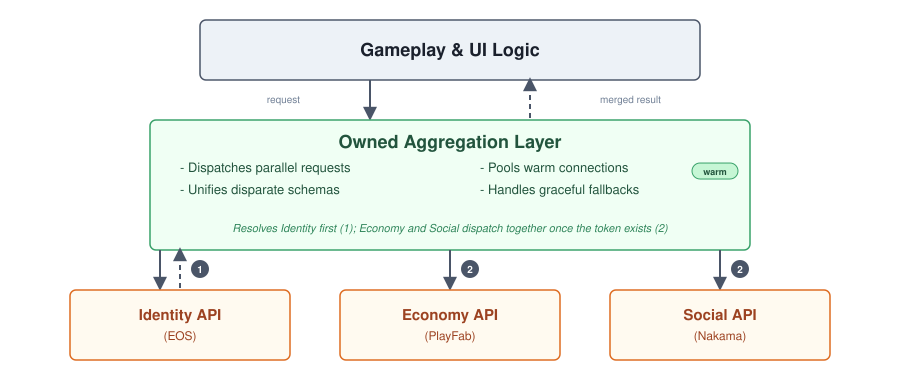

# The Compounding Network Tax

I keep running into the same complaint about loading screens on live-service games with more than one backend behind them: **nobody can point to the one slow thing.** QA files it as "loading takes too long." A network trace gets pulled, but it doesn't show one obviously guilty call. It shows five or six calls, each one taking a few hundred milliseconds, each one pointing to a different service: EOS for identity, PlayFab for inventory, Nakama for social state, an internal config service for feature flags, maybe an observability SDK and a chat filter initializing quietly in the background.

None of them is slow enough on its own to justify a bug report. Added together, **they are the loading screen.**

That is the same shape of problem I wrote about in [AbstractionMeetsTheHotPath.md](AbstractionMeetsTheHotPath.md): no loudest function, a little bit of everything, all at once. Except here the hops aren't reflection-backed attribute lookups inside one process; they are separate services over the network, each one added at a different point in the project for a different, individually reasonable reason.

---

## The Blind Spot: Every Call Looked Free in Isolation

Two costs stack quietly here, and neither one shows up if you only look at a single call by itself.

* **Connection setup tax.** Every new third-party host means a fresh DNS lookup, a TCP handshake, and (almost universally) a TLS handshake before the request payload even starts moving. Depending on region and routing, that cold connection tax easily burns 100 to 300 ms per host. It is the network equivalent of what I wrote about in [TickPitfalls.md](TickPitfalls.md): an empty engine lifecycle hook is never free, and neither is an empty socket. The SDK call itself might be fast; the connection underneath it is not.
* **Chaining tax.** If PlayFab or Nakama needs a token that only EOS can hand out, that one dependency has to stay sequential. Everything downstream of it doesn't. Running independent calls in parallel instead of one after another turns total wait time from the sum of every hop's setup time plus request latency into whichever single hop is slowest.

Parallel execution unconditionally cuts latency, but it does not automatically fix reliability. If rendering the lobby genuinely requires identity, inventory, and social state, three services each reliable at $90\%$ still succeed together only about $72.9\%$ of the time ($0.90 \times 0.90 \times 0.90 \approx 0.729$). The math does not care about concurrency order.

The reliability gain only shows up once data is treated as **optional**: if the UI can render identity and inventory while displaying a placeholder for social state, the odds of retrieving enough usable data jump well above $99\%$. That resilience isn't a free side effect of concurrency; it is earned by deciding, ahead of time, what each call's absence should degrade into.

Underneath both of these sits a third, quieter problem: nothing in most of these integrations distinguishes what actually has to finish before the player can do anything from what is just along for the ride. An observability SDK and a chat filter do not need to block a loading screen. They usually do anyway because nobody made the deliberate call that they shouldn't; they were just added to the generic startup routine because that is where startup code lives.

None of this shows up from staring at any one integration in isolation. EOS's SDK is fine. PlayFab's SDK is fine. Nakama's SDK is fine. The chat filter vendor's onboarding doc is fine. Every single addition passed review on its own merits, the same way the five stat-resolution layers in [AbstractionMeetsTheHotPath.md](AbstractionMeetsTheHotPath.md) each passed review. What nobody owned was the total sequence.

Cold starts make this worse than necessary in a second way:

* **Initial Onboarding:** A first-ever login must pay the full identity handshake; there is no way around that.
* **Returning Sessions:** A returning player holding a valid refresh token or cached session ticket can skip most of that identity round trip entirely.

Plenty of live-service titles pay the full cold tax far more often than once per launch anyway. Teams naively hook re-authentication into world subsystems, player controllers, or menu scripts that get reinitialized on every level transition or match exit. The cost isn't fixed at once per player session; it is fixed at once per naive reinitialization.

Unreal's own extension points make this scattered architecture the default path, much like how [TickPitfalls.md](TickPitfalls.md) describes engine tick registration as an easy default that quietly accumulates overhead. A subsystem's `Initialize()` function is exactly where an engineer is directed to fire off an async HTTP request for their specific service. Every other service owner does the same thing in their own subsystem, independently, leaving the codebase with no shared view of what is running in parallel, what is blocking what, or what sequence actually matters.

This is not a problem unique to games. Mobile app performance guidelines explicitly highlight it for cold starts: even when each SDK's individual footprint looks negligible, the combined cost of several near-invisible integrations is one of the most common reasons an app launch feels sluggish. Games rarely discuss it, perhaps because backend integration gets treated as platform plumbing rather than something requiring its own architecture. It is the same blind spot named in [AI_ArchitectureSkills.md](AI&ArchitectureSkills.md) for a different tool: the friction that used to force deliberate design disappeared, and nobody replaced it with a decision.

---

## The Fix: Decide What's Actually on the Critical Path

The fix isn't "use fewer third parties." Most of these services exist because building an in-house equivalent for identity, economy, and social features from scratch is a worse trade for most teams.

The fix is treating the startup sequence itself as something somebody owns, mirroring the argument from [DataDrivenDesign.md](DataDrivenDesign.md) regarding multi-layered data: the problem was never having more than one layer, it was leaving layer ownership undefined.

Four moves apply here, and they stack rather than compete.

### 1. Run independent calls in parallel, and name the real dependencies explicitly

If PlayFab's inventory call and Nakama's social call do not need each other's results, there is no reason one should wait on the other. Only the requests that genuinely depend on EOS's token should sequence behind it, and that order should be an explicit, documented graph rather than an accidental artifact of execution order.

In Unreal specifically, this means building **custom async Blueprint nodes** rather than letting backend calls block gameplay or UI logic in turn. Game engines do not come with a browser's dynamic data loading idioms built in out of the box, so the async layer must be built on purpose, the same way [OwnershipTaxUE.md](OwnershipTaxUE.md) argues a consumer should be pushed data rather than reaching out and blocking on it.

### 2. Triage what's actually on the critical path

Authentication usually has to finish before anything else can happen. A chat filter's moderation model loading, an observability SDK registering its session, and most analytics calls do not need to block the first playable frame. Deferring or lazy-initializing non-essential SDKs turns a five-call bottleneck into a one- or two-call transition, with the rest completing quietly in the background while the player is already viewing their inventory.

Deferred calls still require strict boundaries. Anything moved off the critical path needs its own hard timeout (e.g., $400\text{ ms}$ before falling back to an empty list). Without explicit deadlines, an unessential background call just relocates the original problem, quietly holding engine resources or hanging an async promise chain long after the player has moved on.

### 3. Put one owned layer between gameplay code and every backend it talks to

This applies the Controller pattern from [BlueprintMess.md](BlueprintMess.md) to network boundaries: UI and gameplay code consuming player data should remain decoupled from external provider topologies. A widget shouldn't know or care that a player profile is assembled across three discrete services.

Be precise about which architecture you are building, as "aggregator" covers two distinct patterns:

* **In-Engine Client Aggregator:** A custom engine subsystem or controller that dispatches parallel async calls and merges the results. This solves data mapping and parallel execution so gameplay code receives a single unified payload, but it **cannot** eliminate the cold connection setup tax. A client rebuilding its TLS handshake to PlayFab on launch pays that cost regardless of client-side orchestration.
* **Server-Side Gateway (BFF):** A dedicated backend-for-frontend service sitting between the game client and third-party APIs. This layer actively eliminates cold setup taxes by collapsing multiple client outbound connections into one while keeping its own upstream sockets warm indefinitely.

A server gateway introduces real infrastructure to maintain, so choosing between client-side orchestration and a server-side gateway should be a deliberate trade-off based on whether scattered calls or cold connection setup is the primary bottleneck. Regardless of location, this layer is where graceful degradation belongs: if a non-essential service times out, the aggregator delivers partial data instead of stalling the game.

### 4. Cache the last known state, and treat the network as a refresh

Some data does not need a live network call blocking the screen at all; it needs a resilient fallback chain.

On one project, clan data from Nakama used a small interface between the UI and the data source:

1. **Live Network:** If connected, the client fetched live clan data.
2. **Local Disk Cache:** If the call failed or timed out, it fell back to a local disk file saved from the last successful session.
3. **UI Defaults:** If no cache existed (such as on a fresh install), it fell back to a plain default state defined directly at the UI layer.

The disk cache was only rewritten at two explicit checkpoints: the initial data response and deliberate update calls, never on raw reads. The player never faced a loading screen that depended strictly on network health; they saw last-known-good data immediately, which refreshed in the background once the live response succeeded.

This fallback chain is what makes parallelization math work in practice. Parallel calls alone only help you reach a failure faster; a **cache-and-default pattern** is what turns a timed-out call into a UI that still renders instantly.

---

## The Insight: A Network Call Is a Hot Path Candidate Too

The mechanic underneath all of this is the same one from [AbstractionMeetsTheHotPath.md](AbstractionMeetsTheHotPath.md), just with a different boundary: **cost is execution frequency multiplied by boundary traversal overhead, constrained by concurrency.**

* A virtual call crosses a vtable the compiler cannot inline across.
* A reflection-backed attribute lookup crosses a dynamic boundary inside Unreal's Gameplay Ability System.
* A third-party network call crosses an even harder boundary: a physical network hop with discrete connection overhead and independent failure modes that client-side code cannot optimize away.

Nobody who integrated EOS, PlayFab, Nakama, a chat filter, or an observability tool made a bad decision in isolation. Each integration solved a real problem and passed code review. What went unmonitored was the cumulative system behavior.

This mirrors the core principle from [DataDrivenDesign.md](DataDrivenDesign.md): **credit the individual case, track the global pattern.** A backend dependency list that starts at one service and grows to six does not cross from performant to slow in a single commit. It degrades quietly across milestones. The only way to catch that crossing is to treat startup dependencies as an actively owned system, continually auditing which calls are permitted to block player progression before QA ever files a loading-screen bug.

---

> **The Production Bottom Line:** Backend and platform SDKs are frequently treated as passive utility code because optimizing their internals belongs to someone else. But every call crosses a real boundary: a socket, a handshake, and an independent chance of failure. Frequency and chaining decide whether that boundary is free or costly, exactly as they do for a virtual function or reflection lookup inside your own process. The fix was never fewer vendors. It was deciding, on purpose, which calls actually have to wait on each other, stripping everything else off the critical path, and placing one owned layer between gameplay code and the wire.