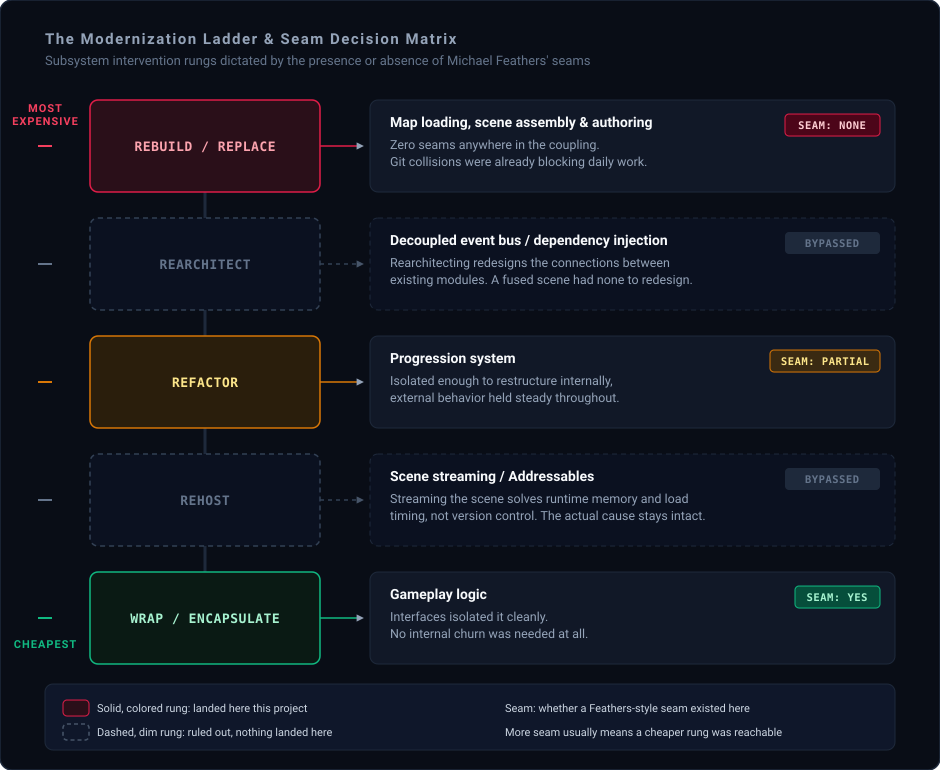

# Finding Seams in a Monolith

The main scene was thirty megabytes of YAML text, and it held almost everything: level geometry, encounter logic, UI hookups, and most of the game rolled into one file, with almost no prefabs anywhere in sight. Two developers working in the repository in the same week would routinely collide, a small content change from one person and an unrelated fix from someone else landing on the exact same lines of the exact same asset, because there was, structurally, almost nowhere else for either change to go.

From outside, this looks like an obvious mistake, the kind of design a lead calls out in a postmortem as something to avoid going forward.

That reaction skips a step. The scene did not end up in that state by accident, and the first productive move isn't moral judgment. It is figuring out what question this structure was originally a correct answer to. **This wasn't anyone setting out to build something unmergeable. It was very likely the right answer to a much earlier, different reality.**

---

### The Blind Spot: The Fence Has a Reason

There is a principle worth borrowing here, even though it was not written for software. In 1929, G.K. Chesterton described an eager reformer who comes across a fence built across a road. Seeing no obvious purpose for it, the reformer demands it be torn down immediately. The wiser response is to refuse demolition until someone can explain, specifically, why it was erected in the first place. Only once you know what problem the fence was built to hold back does removing it become an informed decision instead of a reckless guess.

#### 1. The Ergonomics of the Solo Developer

Applied to a monolithic scene, the fence's purpose becomes obvious the moment you stop treating it as an error. A single developer, working alone, benefits enormously from having everything in one place.

Jumping between a dozen prefab files and separate sub-scenes to adjust one small interaction adds real time and real context-switching cost. Keeping everything inline, directly in the active scene, removes most of that friction. There is little risk of two people colliding over the same asset when only one person is touching it.

Whether that shape came from deliberate systems design or simply from the path of least resistance during solo prototyping does not change the outcome: for an engineering team of exactly one, the monolithic scene was not a defect waiting to be noticed. It fit.

#### 2. Conway's Law in Reverse

The architectural mismatch traces back to a dynamic Melvin Conway identified in 1967: software architecture tends to reflect the communication structure of the organization that builds it.

A team of one has exactly one communication path, itself. A design requiring little cross-developer coordination is close to the structurally correct output for that team, whether or not anyone framed it that way at the start. What actually changed was not the scene. It was the studio sitting on top of it.

A larger team arrived behind the original prototype: more programmers, plus content creators who needed to check in material in parallel. Yet the scene's structure kept mirroring an organization of one well after the team had outgrown that footprint. Whether the original architectural bet still held for a multi-track production team went unasked for a while. The scene did not decay on its own; the studio outgrew what its earlier shape had produced, and the mismatch went unnoticed for a while before it started costing real time.

#### 3. Proving Understanding Before Demolition

Knowing that a fence has a reason does not automatically tell you when you have actually uncovered it. Software engineering research into developer mental models has yet to converge on a single reliable method for comprehending unfamiliar code, and modifying a system on an incomplete mental model tends to make things worse. Confidence is not evidence.

Rather than relying on abstract review, I relied on three practical operational proxies:

* **Paying the production tax firsthand:** I built several full levels inside the existing monolithic setup before proposing a single architectural change, experiencing its friction points directly.
* **The teaching test:** I took on the responsibility of teaching content creators how to place resources within the old pipeline. Being able to teach a system's quirks and real behavior to someone else is one of the oldest working tests for whether you actually understand it, rather than just having an opinion about it.
* **Manual migration parity:** When the new structure went in, I migrated every existing level into it personally, one at a time. Any discrepancy between what the old scene actually evaluated and what the new pipeline produced surfaced on my own workstation, before it could reach anyone else.

This process mirrors a principle worth borrowing from legacy system testing: you do not need access to the original author's private intentions, but you do need to be able to prove, deterministically, what the legacy code actually does under real conditions. That distinction has real limits. This personal verification loop worked because the project had a small, manageable footprint of a few hand-crafted levels. At a scale of hundreds of levels, personal migration stops being viable, and automated behavioral suites need to take its place.

---

### The Fix: Deciding How Much Fence to Tear Down

Once the workload mismatch was clear, the refactor could not be treated as a casual cleanup. It was an intentional re-architecture targeted at the workload the scene now had to support.

#### 1. The Cost of Missing Seams

The refactoring method was dictated by the coupling of the scene itself. In his work on legacy systems, Michael Feathers defines a **seam** as a place where you can alter program behavior without editing the source code directly in place.

The original scene had close to no seams. Level geometry, triggers, UI hookups, and encounter state were physically interleaved inside a single serialized asset. Without a seam, the strangler fig approach I wrote about in [Refactoring a Legacy System at a Critical Point](RefactoringCase.md), growing an isolated replacement alongside the original and migrating it over piece by piece, wasn't available here. When an asset is this fused, incremental, distributed edits across a team tend to magnify merge conflicts rather than resolve them. The honest options narrowed to a planned, single-owner cutover, executed deliberately during an agreed-upon maintenance window to protect the rest of the team from churn.

#### 2. Climbing the Modernization Ladder

A cutover does not mean burning down the entire codebase. Software engineering uses a well-established modernization ladder that ranks interventions from least invasive to most disruptive:

1. **Wrap:** Encase legacy components behind clean interfaces without altering their internals.
2. **Rehost (Migrate):** Move components to a new host or container with minimal changes.
3. **Refactor:** Restructure internal logic to reduce technical debt while preserving outward behavior.
4. **Rearchitect:** Redesign core subsystems to support new capabilities and access patterns.
5. **Rebuild or Replace:** Discard the legacy implementation entirely and engineer a ground-up solution.

The most successful architectural updates apply different rungs of this ladder to different subsystems at once. That was the approach here:

* Gameplay logic was mostly left alone, wrapped behind interfaces where necessary.
* The progression system received minor refactors and adjustments rather than full rewrites.
* The map organization, loading logic, and scene assembly pipeline was pushed all the way to a full rebuild, because it was the one component lacking the seams required for anything cheaper.

#### 3. Declarative Tools Over Monolithic Blobs

The rebuild itself had three core components:

* **Decoupled scenes and explicit lazy loading:** Level assets were broken into distinct, modular chunks, loaded on demand rather than resolving the entire world synchronously on boot.
* **Explicit state machines:** Level transitions and initialization sequences were moved out of implicit script execution order and placed under structured state-machine control.
* **A declarative authoring tool:** Instead of hand-placing prefabs, triggers, and audio directly into a shared scene file, content creators configured levels through a dedicated editor tool. Levels were defined as structured data (specifying resources, enemy encounters, and VFX sequencing) that the engine parsed and instantiated at runtime.

Moving level authorship out of a fused scene file and into a referenced, data-driven pipeline removed most of the merge collisions that used to be routine. Multiple designers could author content across separate data files without touching a single shared scene.

#### 4. The Maintenance Tax of Custom Tooling

Trading an inline workflow for a custom authoring tool is not an unqualified victory, and presenting it as one would be dishonest. Internal tools are long-lived software assets that carry their own ongoing maintenance tax.

A custom level editor needs functional undo and redo stacks, validation to prevent invalid data states, reasonably intuitive UI, and clear documentation. When you extract a problem out of a shared scene file and bury it inside a custom tool, you have not removed the underlying coordination tax, you have relocated it. The engineer who builds the tool becomes its de facto product owner, responsible for supporting content creators and patching editor edge cases across engine upgrades.

That trade was still worth making. The merge failures and blocked production pipelines the monolithic scene was generating were already paralyzing the team. But trading one recurring cost for a smaller, different recurring cost is a more accurate description of what happened than calling the tool a magic fix.

---

### The Insight: Reconstructing the Original Question

A few takeaways generalize past scene organization into any engineering project.

#### 1. Identify the Constraint Before Judging the Implementation

An architecture that looks absurd in hindsight was very likely a sound solution to an earlier, unrecorded operational constraint. Reconstruct that constraint before proposing a change. If you cannot explain why the original team built the fence, you likely don't have the context you need to tear it down safely.

#### 2. Track Workload Drift, Not Just System Health

Systems rarely decay in a vacuum; workloads change underneath them. As teams expand and feature complexity compounds, an architecture that delivered peak velocity for a solo developer tends to turn into a bottleneck for a multi-disciplinary team. Revisit structural assumptions whenever team composition or concurrency patterns meaningfully shift.

#### 3. Require Operational Proof Over Subjective Confidence

A true mental model of an unfamiliar system is hard to validate through intuition alone. Look for concrete, domain-specific verification proxies: teaching the system's operational realities to a teammate, establishing behavioral parity through deterministic migrations, or isolating regressions with end-to-end integration tests. If you cannot demonstrate what the system actually does, you are probably not ready to rewrite it.

---

### The Production Bottom Line

> An architecture that looks wrong from the outside is often a correct answer to a question that was never written down anywhere.
>
> The engineering discipline is not refusing to touch legacy systems, nor is it tearing them down on sight. It is reconstructing the original constraints before editing the design, acknowledging that personal confidence is not the same thing as verified understanding, and then climbing only as high on the modernization ladder as the real bottleneck requires. Go further than that and you're rebuilding something that could have been cheaply wrapped. Stop short of it and you're patching something that actually needed to come down, which just moves the same failure to a later, more expensive date. Neither mistake tends to announce itself in advance, which is exactly why the height of the climb deserves the same scrutiny as the decision to climb at all.