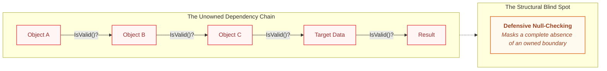

# Ownership Tax in Unreal Engine

I was reviewing a code review (simplified and anonymized) when four lines made me stop scrolling:

```cpp
const AMyVehicleSeatComponent* SeatComp = PlayerController->GetCurrentSeat();
const AMyInventoryComponent* Inventory = IsValid(SeatComp) ? SeatComp->GetSeatPawnInventory() : nullptr;
AMyWeapon* EquippedWeapon = IsValid(Inventory) ? Cast<AMyWeapon>(Inventory->CurrentWeapon) : nullptr;
WeaponStaticInfo = IsValid(EquippedWeapon) ? EquippedWeapon->GetWeaponStaticInfo() : nullptr;

```

My first instinct was the instinct of someone who had spent years in C#: this is just verbose, shorten it. Surely there was a C++ equivalent of the Elvis operator (`?.`), something that collapsed four defensive checks into one clean expression. I went looking. Proxy classes, macros, template tricks: none of it got anywhere close to the conciseness C# gives you for free.

Then, half out of frustration, I wrote the whole thing out the way it would actually look in C# as a single line:

```csharp
WeaponStaticInfo = PlayerController?.GetCurrentSeat()?.GetSeatPawnInventory()?.CurrentWeapon?.GetWeaponStaticInfo();
```

That is when it landed: **the problem was never the verbosity.** Four dependencies chained this deep together should not have been happening in the first place. The problem wasn't "should be shorter," it was **should not exist**.

I asked around, and this line wasn't unique. The pattern showed up across the project. When I asked why, the answers were some version of "that's just how it's done here," or "I copied the approach from somewhere else in the codebase." Nobody had written it out of carelessness. Everyone had inherited it from somewhere, and nobody had stopped to ask why it was there.

---

## The Blind Spot: A Chain Nobody Owns

Strip the specifics away and the pattern is a well-known one outside games: the **train wreck**, a chain of method calls that reaches through several objects to grab something buried several levels deep. It has a name because it has needed one for decades: the **Law of Demeter** (formulated in 1987) states that *a method should only talk to its parameters, its own components, or itself*, not reach through a stranger to get to a stranger's stranger.

Knowing the name does not make the chain go away, and in Unreal Engine specifically, there is a second, sharper reason it keeps happening:



In a managed language, a null reference exception tells you immediately and loudly that something you assumed was there wasn't. In Unreal C++, a destroyed actor does not have its raw references cleared the moment it dies. They stay valid-looking (technically non-null) until the garbage collector actually runs and sweeps them. `IsValid()` exists specifically to catch that gap.

So every hop in that chain is not just walking through objects it does not own; it is also asking a second question at every step: **has this specific thing been destroyed but not yet collected?**

Two different problems are riding on the same four lines, and the code only visibly answers one of them. That is the actual blind spot:

* The chain is not sloppy. It is **composition without an owned boundary**.
* Nobody decided who is responsible for keeping that reference valid, so every consumer is left defending itself individually at every hop, forever.
* `IsValid()` answers one narrow question: *does this object still exist?* It does not answer whether it is still the seat the player is sitting in, or still the weapon currently equipped.

The code above is quietly asking `IsValid()` to answer both, and it can only actually answer one.

---

## The Fix: Push the Boundary to Where the Change Happens

The chain gets long because every consumer pulls the same data on demand, re-deriving it from scratch and re-validating every hop, every single time it is needed. The fix is to move that work to the one place that actually knows when it matters: **the moment the underlying thing changes.**

### 1. Broadcast the Change, Don't Re-Derive It

Unreal's multicast delegates are a native, idiomatic way to handle this, applying the same principle already covered in [The Engineer-Designer Boundary in Unreal Engine](BlueprintMess.md): the consumer should be dumb. It should not reach up and pull; it should listen for what gets pushed down.

```cpp
// Owning component broadcasts ONCE, when the weapon actually changes
DECLARE_MULTICAST_DELEGATE_OneParam(FOnEquippedWeaponChanged, AMyWeapon*);
FOnEquippedWeaponChanged OnEquippedWeaponChanged;

void UMyInventoryComponent::SetCurrentWeapon(AMyWeapon* NewWeapon)
{
    CurrentWeapon = NewWeapon;
    OnEquippedWeaponChanged.Broadcast(CurrentWeapon);
}

```

```cpp
// Consumer subscribes ONCE, caching a validated reference between events
void UMyWeaponHandlingIndicator::OnWeaponChanged(AMyWeapon* NewWeapon)
{
    CachedWeapon = NewWeapon;
}

```

The four-hop chain collapses into a single cached pointer, refreshed exactly when it needs to be, rather than re-walked on every access. This alone removes most of the reason the chain got long in the first place.

### 2. Let Weak Pointers Handle Lifecycle Safety

Once the chain is collapsed to a single cached reference instead of four re-derived hops, `TWeakObjectPtr` and `IsValid()` can go back to answering the question they were actually designed to answer: **does this specific object still exist?**

You are no longer asking that question five times to get one answer; you are asking it once, about the one reference you actually kept.

```cpp
TWeakObjectPtr<AMyWeapon> CachedWeapon;

void UMyWeaponHandlingIndicator::UpdateIndicator()
{
    if (!CachedWeapon.IsValid())
    {
        return;
    }

    const auto* Info = CachedWeapon->GetWeaponStaticInfo();
    // Use validated static info cleanly...
}

```

### 3. Use Interfaces to Shorten Remaining Chains

Push events remove most of the chain, but not all reach-through disappears. Where a consumer genuinely needs to ask an actor for something without knowing its concrete type, a narrow interface draws a clear boundary between what the caller depends on and what the actor actually is underneath (similar to the accessor strategy in [Upgrading Game Engines Safely](EngineUpgradeCase.md)).

```cpp
UINTERFACE(MinimalAPI)
class UWeaponProvider : public UInterface { GENERATED_BODY() };

class IWeaponProvider
{
    GENERATED_BODY()
public:
    UFUNCTION(BlueprintNativeEvent)
    AMyWeapon* GetEquippedWeapon() const;
};

```

The caller depends on `IWeaponProvider`, not on `PlayerController`, `SeatComponent`, and `InventoryComponent` all at once. If the internal structure changes later, one class updates its interface implementation, and nothing downstream has to change at all.

---

## The Insight: Normalization of Deviance

It would be easy to read the chain as a discipline failure, and it would also be wrong to read it as pure ignorance. Single Responsibility Principle (SRP), Liskov Substitution (LSP), Event-Driven Design: none of this is secret knowledge. Every engineer who wrote a hop in that chain almost certainly already knew the principle being violated. So the honest question isn't "did anyone know better?" It's why knowing better didn't stop it.

Part of the answer is structural. Unreal ships with no native dependency injection (nothing like the container that comes built into a modern C# framework). The tooling that exists is third-party, built around a singleton registry, and bolted on rather than idiomatic. And the engine's own on-ramp points the other way: `GetOwner()`, `GetComponentByClass()`, and `Cast<>` are the first tools every Unreal tutorial teaches because they are what the framework hands you by default.

The chain wasn't a developer ignoring the idiomatic path. It mostly *was* the idiomatic path, followed one hop past where it should have stopped.

But that only explains why the first instance was easy to write. It doesn't explain why it kept happening, unflagged, across a codebase full of engineers who already knew the principles. That part is closer to a concept outside software: **normalization of deviance** (a practice that should raise a flag stops raising one, not because anyone decided it was fine, but because it survived long enough without visible consequence that people stopped noticing it as a deviation at all).

Code smells are only sniffable because of trained familiarity. Naming and repeatedly catching a pattern is what builds the reflex to flag it in review. A chain of casts reads as instantly suspicious in a language where syntax makes coupling visually loud. In Unreal C++, the same smell wears a disguise:

> **The False Sense of Security:** Every hop has an `IsValid()` check, and that check reads as diligence rather than as a warning sign. The exact habit meant to prevent bugs is also what makes tight coupling look responsible instead of wrong, so the reflex that should fire never does.

This is the exact same mechanism behind [The Invisible Rebuild Bottleneck](SilentBuildProblem.md): a cost survives not because it is hidden, but because the way people cope with it looks like discipline. Reading a diff while a rebuild churns looks like using the wait time well. Writing an `IsValid()` check at every hop looks like careful engineering. In both cases, the coping behavior is exactly what stops anyone from asking why the cost exists at all, or whose job it was to remove it rather than absorb it.

---

## The Production Bottom Line

>**Ownership Is Architecture:** A chain of `IsValid()` checks is not a warning sign about one careless line. It is a symptom of a decision nobody made: **who owns this reference, and who is only borrowing it?**
>
>Unreal's framework defaults make that chain easy to write, and the diligence of checking every hop makes it easy to miss, but neither one writes the code by itself. Someone still has to notice the fifth instance of the same shape and ask why it exists, and someone still has to decide the boundary is worth building instead of worth coping with.
>
>The fix was never about writing more careful null checks. It was about deciding, once, at the boundary where a value actually changes, who is responsible for keeping it valid, and choosing to spend the effort making that decision instead of absorbing its cost quietly, one `IsValid()` at a time.