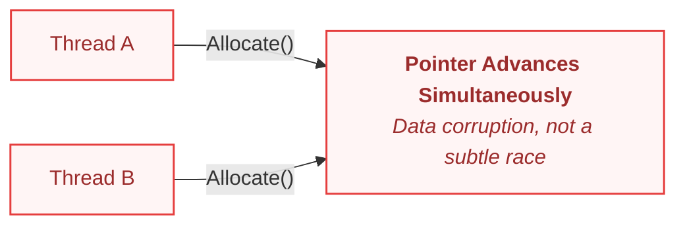
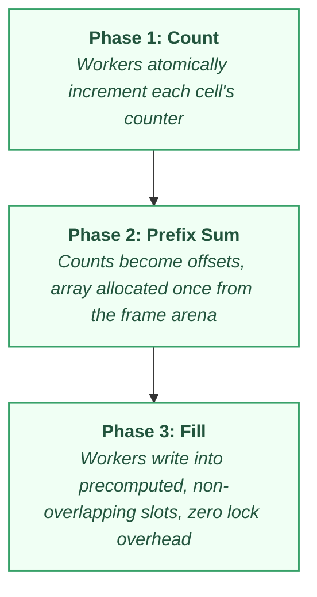

# Concurrency Is Architecture

The plan for parallelizing [ParticleSim's](https://github.com/Atimormia/ParticleSim) spatial grid looked obvious on paper: give each worker thread its own temporary buckets, let it bin particles into them independently, and merge at the end. Something like this:

```cpp
// Each worker grabs its own temporary buckets from the frame arena
scheduler.parallelFor(0, particleCount, chunkSize, [&](size_t i)
{
    const size_t cellIndex = ComputeCell(positions[i]);
    auto* bucket = arena.Allocate<CellBucket>();
    bucket->Add(i);
});

```

It corrupted memory immediately. Not occasionally, not under a heavy load, but immediately on the run.

The frame arena I had been so careful with in the single-threaded version (deliberately keeping it out of unpredictable allocation patterns) had a second, sharper flaw the moment a second thread touched it: **an arena allocator is just a pointer that advances**. Nothing about advancing a pointer is safe to do from two threads at once. Two workers calling `Allocate` at the same moment could walk away with the exact same memory offset, or corrupt the pointer itself mid-advance.

There was no subtle race condition, no flickering graphics, and no occasional wrong pixel. It broke completely, every single time. That failure forced me to stop and evaluate what parallelism was exposing rather than just patching the crash.

---

## The Blind Spot: Threads Reveal Architectural Flaws

The immediate instinct is to treat this as a threading bug: add a lock, protect the allocator, and move on. That instinct is wrong in a fundamental way.

The frame arena wasn't broken by concurrency; it was never given an **explicit owner** in the first place. In single-threaded execution, that omission stayed invisible because there was only ever one caller. Parallelism didn't introduce the ownership gap, it just made the gap observable.



This realization reframes the entire discipline of concurrency infrastructure. Every primitive (thread pools, fibers, work-stealing, and dependency fences) exists for one reason: **to avoid ever needing a lock in the first place.**

* **Thread pools** exist because OS threads are expensive to create. A fixed set of workers, spun up once, removes creation overhead from the hot path.
* **Work stealing** exists because a single shared queue creates contention. Idle workers pull from busy workers' local queues instead of blocking a central point.
* **Fibers** solve a specific problem: a job waiting on another job's result. Without them, a worker thread either blocks (wasting an entire OS thread) or the job must be rewritten as a callback. A fiber is a cheap, user-space context that a worker can suspend and resume without an OS-level context switch. (This is the core idea behind the fiber-based job system Naughty Dog built for *The Last of Us*.)
* **Dependency fences** replace a mutex around a shared state with a hard barrier between execution phases. Nothing overlaps, so nothing needs to be protected.

A lock is what you reach for when the ownership question wasn't answered ahead of time.

---

## The Fix: Four Levels of Concurrency Architecture

ParticleSim's scheduler is a simple, textbook thread pool: a mutex-and-condition-variable task queue, an atomic counter tracking in-flight work separately from queue emptiness, and a clean shutdown sequence.

```cpp
void ThreadPoolScheduler::parallelFor(
    size_t begin, size_t end, size_t chunkSize,
    const std::function<void(size_t)> &fn)
{
    const size_t total = end - begin;
    const size_t chunks = (total + chunkSize - 1) / chunkSize;

    for (size_t c = 0; c < chunks; ++c)
    {
        const size_t chunkBegin = begin + c * chunkSize;
        const size_t chunkEnd = std::min(chunkBegin + chunkSize, end);

        submit([=]
        {
            for (size_t i = chunkBegin; i < chunkEnd; ++i)
                fn(i);
        });
    }

    wait();
}

```

This design pays a real performance cost: `submit([=]{ ... })` captures by value into a type-erased `std::function` for every chunk call. As noted in [The Hidden Cost of Garbage Collection](GarbageCollection.md), capturing by value creates a hidden heap allocation inside the closure.

Where this scheduler succeeds is where the underlying data architecture was already correct. The particle update loop parallelizes cleanly:

```cpp
scheduler.parallelFor(0, count, 256, [&](size_t i)
{
    if (alive_p[i] == 0)
        return;

    float vx = vel_x[i] + acc_x[i] * dt;
    float vy = vel_y[i] + acc_y[i] * dt;
    vel_x[i] = vx;
    vel_y[i] = vy;

    pos_x[i] += vx * dt;
    pos_y[i] += vy * dt;
});

```

Raw pointers into the Structure of Arrays (SoA) layout are pulled once before the loop and chunked by index range. Each worker touches only its own slice of memory. There is no lock because the data layout decision from [Data Layout Is Architecture](DataLayoutIsArchitecture.md) answered the ownership question before parallelism ever entered the code.

The grid build, however, required restructuring the algorithm into **three distinct phases separated by fences**:



1. **Count Phase:** Each worker determines which cell its assigned particles belong to and atomically increments that cell's counter. Incrementing an integer counter is a single atomic operation, not a pointer-advancing allocation.
2. **Prefix Sum Phase:** The counts are aggregated on the main thread to define each cell's exact offset inside a single, contiguous array. Memory is allocated once from the frame arena before any worker touches it again.
3. **Fill Phase:** Workers process particles a second time, writing each index directly into its precomputed, non-overlapping slot using an atomic write cursor.

No two workers ever write to the same memory location, not because a lock stopped them, but because Phase 2 pre-calculated exactly where each worker was allowed to write. This restructuring increased the grid build rate from **10 million to 26.8 million particle insertions per second** while remaining fully thread-safe.

Comparing this approach across the industry shows four distinct levels of concurrency architecture:

1. **Hand-Built Phase Separation (ParticleSim):** Manually restructuring algorithms into non-overlapping memory sweeps separated by synchronization fences.
2. **Task Graph Systems (Unreal Engine):** Dependency-driven graphs of work units tracked via `FGraphEventRef`. It relies on the programmer to declare dependencies correctly and offers no structural compiler guarantees if they fail to do so.
3. **Container-Level Safety (Unity Job System):** Tracks data access at schedule time using `NativeContainer` wrappers. The scheduler refuses to run two jobs that write to the same container without a declared dependency, throwing an exception instead of corrupting memory.
4. **Fiber-Based Job Systems (Naughty Dog):** Solves the problem of waiting on dependencies mid-execution. A worker thread suspends the waiting job's fiber (saving stack and register state without an OS context switch) and immediately picks up another queued job, keeping worker threads at 100% utilization.

---

## The Insight: Ownership in Lock-Free Systems

Stripping away language and framework differences reveals three core rules for high-performance parallel systems:

* **Partition by Disjoint Ranges:** If two workers never touch the same memory, no protection overhead is required.
* **Separate Phases with Fences:** Rather than guarding shared state with a mutex, compute non-overlapping memory destinations before workers begin writing.
* **Enforce Ownership Boundaries:** Make illegal memory sharing impossible through container choices or API contracts.

This mirrors the core lesson from [Ownership Tax in Unreal Engine](OwnershipTaxUE.md). A mutex and a chain of `IsValid()` checks are the exact same coping mechanism: both are symptom-level fixes for an architectural question that was never answered ahead of time (namely: *who owns this memory, and who is allowed to access it?*).

Parallelism doesn't create new categories of bugs. It simply removes the one place an unanswered ownership question could hide: **timing**. Single-threaded code can quietly get away with unowned references because there is only ever one caller. The moment a second thread arrives, unowned architecture immediately becomes a production crash.

---

## The Production Bottom Line

> **Concurrency Is Architecture:** A lock is not a fix; it is a confession that the ownership question was asked too late. Every serious piece of concurrency infrastructure exists to avoid ever needing one. The frame arena in ParticleSim didn't break because two threads touched it; it broke because nothing had ever decided who was allowed to own it. Parallelism doesn't punish code speed; it punishes architecture that was never designed to handle concurrent access.