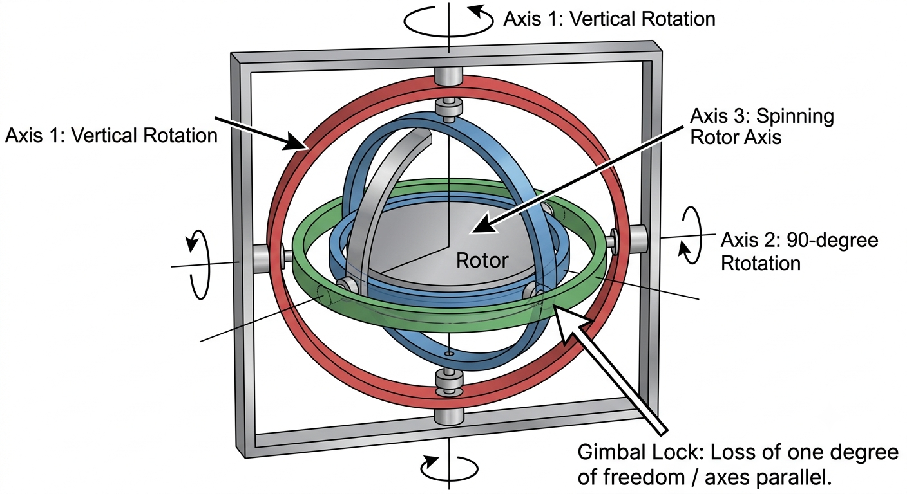
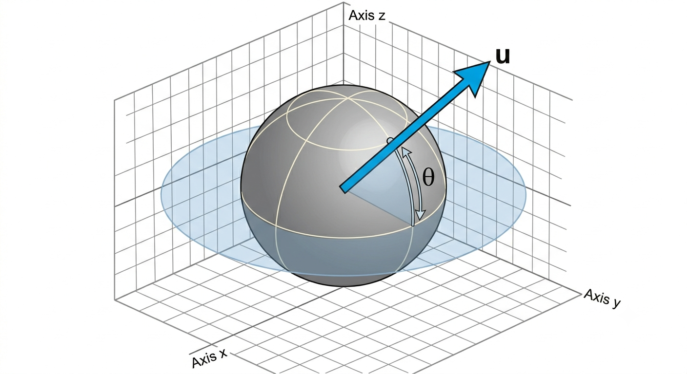

# Quaternions in Games

Open up any major game engine — whether you're writing raw C++ in Unreal Engine or scripting in Unity — and look at how rotation is handled under the hood. You will immediately run into a structure called `FQuat` or `Quaternion`.

If you ask a junior engineer *why* we use them, you’ll almost always get the exact same textbook response: *"To avoid Gimbal Lock."*, but treat quaternions as a magical black box. They copy-paste equations, call engine helper functions like `FQuat::MakeFromEuler`, and treat the underlying four-dimensional math ($x, y, z, w$) as an impenetrable secret.

As someone with a background in mathematics, I love demystifying this exact topic. Let's open up the black box, look at the geometry, and understand why a four-component representation is so useful for making 3D spatial rotation stable, compact, and interpolation-friendly.

---

## The Blind Spot: Why Can’t We Just Use Euler Angles?

Intuitively, humans think in Euler angles: **Pitch, Yaw, and Roll** ($X, Y, Z$). It feels clean and logical. You rotate around the X-axis, then the Y-axis, then the Z-axis.

The problem is that Euler angles calculate rotations *sequentially*. To find a final orientation, the engine must apply the X rotation, then the modified Y rotation, and finally the modified Z rotation. This sequential dependency creates a mathematical trap: **Gimbal Lock**.

Gimbal lock is a fundamental limitation of 3D non-linear geometry. When you rotate an object (like a camera or a spaceship) in such a way that two of its three rotational axes align, you lose a degree of freedom.



Imagine a gyroscope: if you pitch your vehicle exactly 90 degrees upward, your Roll axis becomes perfectly parallel to your Yaw axis. Suddenly, changing your roll changes your yaw in the exact same way. You have physically lost a dimension of control.

In code, this manifests as erratic camera judder, broken character tracking, and interpolation paths that wildly snap because the math simply runs out of coordinate space to calculate a smooth transition between frames.

---

## The Fix: Opening the 4D Black Box

To fix a loss of a dimension in 3D space, we have to look one step higher. Quaternions don't just "fix" Gimbal Lock by accident; they bypass it entirely by abandoning sequential axial rotations.

Instead of thinking about spinning an object around $X$, then $Y$, then $Z$, a Quaternion treats rotation as a single, absolute event: **rotating by a specific angle ($\theta$) around a single, arbitrary axis vector ($\vec{u}$) in 3D space.**



A Quaternion is written as four distinct components:

$$q = (x, y, z, w)$$

Where the vector portion ($x, y, z$) and the scalar portion ($w$) are derived directly from that arbitrary axis and rotation angle:

$$x = u_x \cdot \sin\left(\frac{\theta}{2}\right)$$

$$y = u_y \cdot \sin\left(\frac{\theta}{2}\right)$$

$$z = u_z \cdot \sin\left(\frac{\theta}{2}\right)$$

$$w = \cos\left(\frac{\theta}{2}\right)$$

### Why the Half-Angle ($\frac{\theta}{2}$)?

To rotate a 3D vector $\vec{v}$ using a Quaternion, we can't just multiply them together directly because their dimensions don't match. Instead, the math requires a sandwich operation:

$$\vec{v}' = q \cdot \vec{v} \cdot q^{-1}$$

The half-angle appears because a unit quaternion represents orientation on a 4D unit sphere, and the sandwich product maps that quaternion action back into 3D space. Using $\sin\left(\frac{\theta}{2}\right)$ and $\cos\left(\frac{\theta}{2}\right)$ ensures that the resulting 3D vector rotation is exactly $\theta$, not $2\theta$.

---

## The Insight: Why This Wins

When discussing spatial math with a Tech Lead, you want to move past the abstract geometry and focus on why this matters for the framework architecture. Quaternions don't just solve Gimbal Lock; they fundamentally solve **interpolation**.

If you try to blend between two Euler rotations (`(0, 0, 0)` and `(90, 45, 180)`) using standard linear interpolation (Lerp), the results are disastrous. The camera will trace a bizarre, looping arc because it's blending three separate historical curves independently.

Because Quaternions map smoothly to the surface of a 4D hypersphere, we can use **Spherical Linear Interpolation (Slerp)**.

```cpp
// Smoothly blending character rotation in Unreal Engine C++
FQuat CurrentRotation = GetActorQuat();
FQuat TargetRotation = DestinationComponent->GetComponentQuat();

// Slerp calculates the absolute shortest path along a 4D sphere surface
FQuat SmoothedRotation = FQuat::Slerp(CurrentRotation, TargetRotation, DeltaTime * TrackingSpeed);
SetActorRotation(SmoothedRotation);

```

Slerp guarantees that the object will rotate along the **absolute shortest geometric path** between two orientations at a perfectly constant velocity, with zero risk of axis lock, no matter how extreme the angles are.

---

## The Production Bottom Line

> **Mathematical Empathy:** Demystifying Quaternions isn't about memorizing complex multi-dimensional proofs; it's about building spatial systems that are mathematically stable. By moving away from sequential Euler thinking and recognizing Quaternions as an axis-angle pairing mapped to a 4D coordinate system, you build gameplay loops, animation blenders, and camera rigs that are inherently robust, predictable, and free from precision anomalies.
