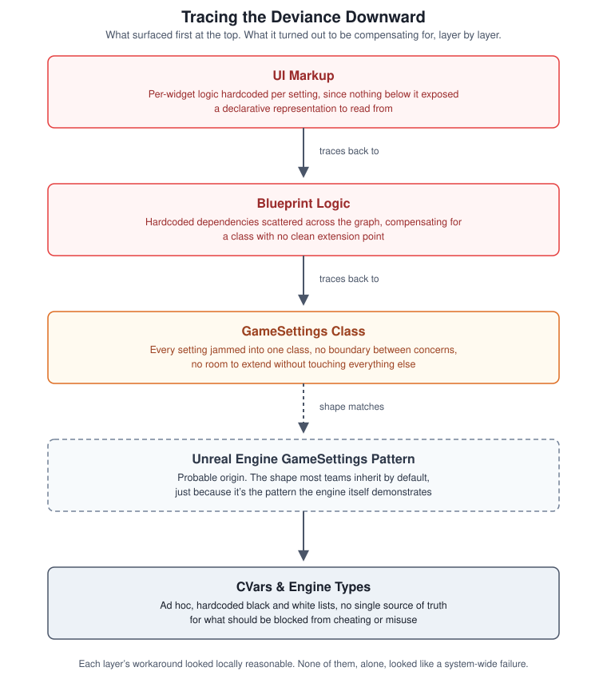
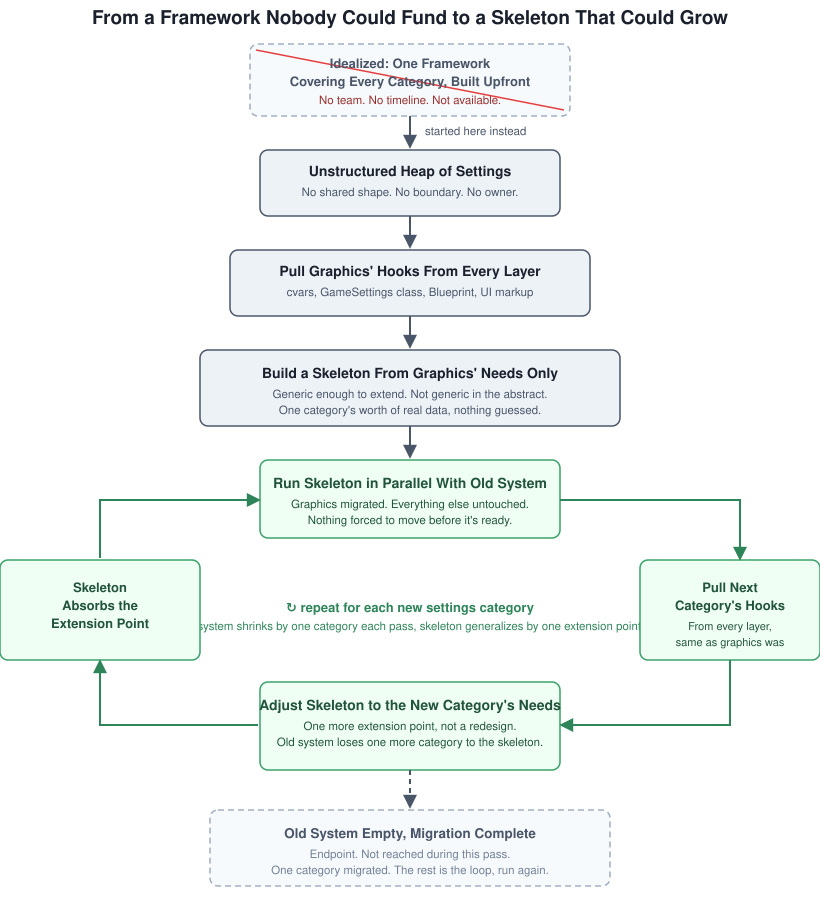

# Refactoring a Legacy System at a Critical Point

I was handed a simple task: wire a new graphics library into an existing game's settings system. On paper, it read like a straightforward correspondence problem: map the old library's options onto the new ones, nothing more.

A bit of initial digging revealed otherwise. Nobody had actually decided how the new settings should behave, only that they needed to exist. This wasn't a technical gap; it was **a decision that had simply never been made**: what should carry over, what should change, and what "correct" even meant here.

I thought the code might give me the answer. Even without written documentation, I assumed the structure of the existing settings system would show how it was supposed to work, allowing me to infer the rest. So I went looking for that structure.

What I found instead was code that was neither documented nor self-documenting. Nothing about the design revealed its purpose or why it looked the way it did. I kept digging past the C++ class itself, into the Blueprint logic on top of it, and down into the CVars below that, expecting to eventually hit a layer where the shape made sense. I never hit that layer. What I found at every level was more of the same absence, until it stopped looking like a documentation gap and started looking like **a system that had rotted from the inside** (to the point where leaving it alone was no longer an option).

---

## The Blind Spot: Recognizing a System at a Critical Point

I didn't have to take my own word for how bad this was. Ask anyone who had touched the settings system and you got the same reaction: **it was the part of the codebase everyone dreaded being assigned to**. Customer support had a running list of critical bug reports tied to cvar cheating exploits (values that should have been locked down but weren't, because no single place tracked what should be blocked). Players were repeatedly asking for graphics settings that would scale the game down for older machines, a request the current system had no clean way to support. When I checked, our sister project suffered from the exact same rot, arrived at independently. This wasn't one team's carelessness: **it was what this architecture produced by default wherever it was used**.

A simple wiring task doesn't usually come with that much evidence attached: missing documentation, real customer impact, team consensus that the system was broken, and a second project proving it wasn't a one-off. That combination turned *"this will take longer than expected"* into ***"this system is at a critical point, and pretending otherwise is a choice."***

### Tracing the Architectural Deviance Downward

The evidence proved this was serious, but it didn't explain why. When I dug deeper, I found that the issue wasn't a single bad decision at the root. Instead, **the same failure mode repeated at every layer**, with each layer compensating for the total lack of boundaries below it.

* **UI Markup:** Hardcoded per-widget logic because nothing below it exposed a declarative way to describe a setting.
* **Blueprint Layer:** Hardcoded dependencies directly into the graph because the `GameSettings` class offered no clean extension point.
* **GameSettings Class:** Jammed every setting into a single monolithic place because that was the shape it inherited (the same default pattern Unreal Engine demonstrates). While I can't prove that is where it originated, the structural similarity is too strong to ignore.

To be precise about what this diagram claims: **this is not an argument that Epic's default pattern is at fault**. Building an abstraction layer on top of engine defaults (and noticing early enough that one was missing) was our responsibility, not the engine's. Why four layers of compensation went unflagged long enough to reach the UI is a valid question, but it is a process question about team ownership, not an architecture question. Mechanically, the diagram shows **how a missing boundary at one layer quietly becomes the next layer's problem to solve**, climbing upward as long as each local fix appears reasonable in isolation.

This follows the exact same pattern as the [Ownership Tax in Unreal Engine](OwnershipTaxUE.md) chain, observed migrating across system layers rather than remaining inside a single function. In that case, every `IsValid()` check felt like diligence, which allowed underlying coupling to go unquestioned. Here, **every layer's workaround looked like a reasonable, self-contained patch**, allowing architectural deviance to travel four layers deep without anyone questioning the root cause.

---

## The Fix: The Cost of the Textbook Sequence

The standard refactoring playbook isn't a mystery:

1. **Map churn against dependency centrality** to isolate high-risk files (the ones that change constantly and have heavy dependencies).
2. **Decouple high-risk nodes behind interfaces** so consumers rely on contracts rather than concrete implementations.
3. **Migrate incrementally** beneath existing call sites, verifying that the new architecture matches legacy behavior before removing old code.

This sequence is undeniably correct, but **it relies entirely on a trustworthy map**: reliable churn metrics, clear centrality data, and an accurate record of past decisions. The core question wasn't whether the textbook approach was correct, but whether such a map existed for this system. It didn't.

I ran an honest calculation of what a full fix required: documenting the legacy system, designing a target architecture, executing a phased migration, and testing against years of accumulated behavior. Coordinated across QA, design, and engineering, this wasn't a two-week task attached to a library swap; **it was realistically months of dedicated team effort**.

So I asked for support. I presented a proposal to my tech lead to secure the preconditions the textbook sequence requires: dedicated resources to document existing settings behavior (QA), verify active settings with customer support (designers), and consolidate cheating-related CVars before laying down permanent architecture.

---

## The Practice: Building the Map That Didn't Exist

What I got back was agreement that the system needed refactoring, but no clarity on when or from whom I'd get help. No QA pass, no designer verification, no timeline, and implicitly, no external priorities shaping how or when this got solved. What I had access to was my own hours and whatever information I could reconstruct alone.

### Reality vs. Textbook Strategy

The local improvements I tried first (tightening a validation check here, adding structure to graphics option parsing there) were attempts to avoid the larger issue: patch enough to ship, and let the real technical debt sit unpaid for another cycle. They failed because patching a symptom in a system rotten at every layer simply relocates the failure; it doesn't remove it.

Once I admitted that, the core question shifted from *"what do I fix?"* to *"where do I position myself between my two actual options?"* One option was to continue patching and pray nothing broke (jamming changes in as everyone before me had done). The other was the full textbook sequence, which required a team and a timeline that didn't exist. Neither was actionable as stated. I needed a third approach: a pragmatic position that a single engineer with limited hours and context could execute. The choice wasn't between the textbook sequence and a bad hack; **it was between doing the mapping myself, on my own time, or not doing it at all**.

### System Archaeology

So I did it myself. The next few weeks weren't spent writing architecture; they were spent reconstructing enough of the picture, layer by layer, to make a realistic scoping decision: what existing settings actually did, how dependencies overlapped, what the new graphics library required, and what "done" even meant for a system nobody had fully understood in years. That analysis produced the layered breakdown above. It wasn't visible from the outside; it only emerged once I went looking.

### Strangler Fig Implementation

That map allowed me to break out of the bind between delivery deadlines and root-cause fixes. **Cataloguing settings by structural shape rather than feature area** (grouping by dependencies, validation rules, and UI representation) revealed the core requirements across all four layers. While I didn't have uniform data for every subsystem, I had robust data for graphics because I had spent two weeks reconstructing it.

Accepting this reality meant accepting a clear constraint. I built a skeleton using the minimum information available, localized entirely to one category of settings, fully aware that other categories retained the same rot. I didn't build a sweeping settings framework. Instead, **I built a skeleton proven against one real-world category**, small enough to ship inside a UE4 to UE5 migration, structured so future engineers could extend it rather than start over, and transparent about the fact that cvar consolidation remained unfinished.

What I delivered wasn't a scaled-down version of the textbook plan. It was a fundamentally different pattern designed to run on one person's capacity rather than a full team's calendar.

The bootstrap process ran once: extract graphics hooks across all layers, build a targeted skeleton for graphics requirements, and include extension points for patterns visible in other categories. Beyond that initial step, the strategy is an iterative loop:

* Run the new structure alongside the legacy system.
* Extract the next category's hooks using the same method.
* Extend the skeleton to accommodate the new category's requirements.
* Shrink the legacy system by one category at a time.

I ran this loop once for graphics because that matched my available capacity. What I handed off to the team wasn't a finished, static framework; **it was a proven, repeatable loop**, validated against real production needs with clear extension points for the next engineer.

---

## The Insight: The Gap Is the Judgment Call

The divergence between the textbook sequence and what was actually executed isn't a failure to follow best practices. Textbook strategies assume team support: dedicated roles for documentation, planning, and testing, spread across an adequate timeline. When those resources don't exist, the choice isn't binary between "do it right" or "do it fast." The real task is selecting an achievable middle ground between jamming in a fragile hack or waiting for funding that will never arrive.

That middle path (cataloguing by structural shape, scoping strictly to verified data, and explicitly documenting unresolved risks) is the senior engineering call. It succeeds not because it is clean, but because **it represents the optimal version of "correct" achievable within realistic constraints**.

---

## The Production Bottom Line

> **Compression, Not Compromise:** The graphics library was never the primary hurdle. The real challenge was recognizing that an undocumented legacy system prohibits textbook refactoring, and making the decision to build the map independently rather than skipping analysis or waiting for dedicated resources. Knowing how to compress a refactoring sequence under tight constraints (and explicitly acknowledging what was left out) is what separates a successful refactor from an unrequested rewrite.