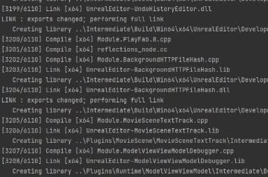
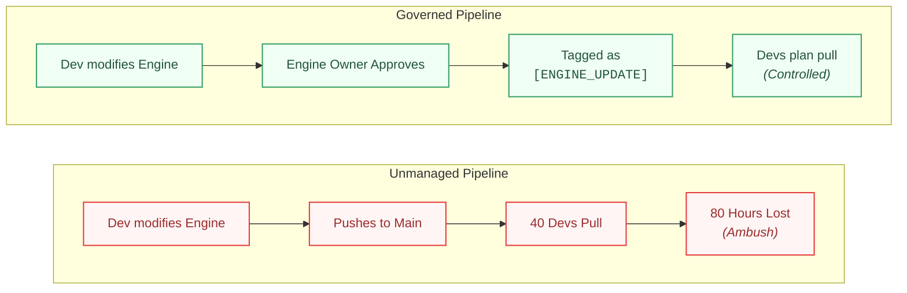

# The Invisible Rebuild Bottleneck

It is a regular Tuesday. You circle the parking lot twice before finding a spot, and the office coffee tastes like office coffee. On the way to your desk, a couple of artists are joking near the kitchen: *"Don't touch main, it's building again."* You laugh, grab your mug, and don't think much of it.

You sit down, actually excited about the task in your queue. You pull the latest version of `main`. The terminal scrolls normally for a few seconds, and then it stops on something you don't usually see: **engine source files.**

You already know what this means before you even finish reading the log.

Six thousand files. Two hours, maybe more. You open a second monitor, start reading the diff to get a head start on the task you were excited about ten minutes ago, and settle in to wait.

Most days, builds are fast. But a few mornings a month, someone touches engine code, and suddenly a 40-person team is paralyzed. The craziest part? There is no stack trace. The build eventually finishes, the game runs fine, and nothing crashes. The cost isn't a bug: it is forty highly paid developers silently deciding that burning two hours of their morning is just "how the job works."

---

## The Blind Spot

The two hours aren't the frustrating part. What's frustrating is that they're almost entirely unpredictable, and almost entirely un-owned.

### 1. Waiting Looks Like Working

You can't see it coming. Nothing in a normal pull warns you an engine-side change landed overnight. So it just happens to you. You come in ready to start a task, pull, and get a rebuild instead.

When you're hit with it, the natural move is to do something useful while you wait: read the diff, plan the task, review a PR. It feels productive, and in a narrow sense it is. That's exactly what makes the cost invisible: nobody is standing around visibly blocked, so nobody is counting the hours as lost (*40 developers × 2 hours = 80 lost developer hours in a single morning*).

This wasn't a secret. It came up in retros and hallway conversations. But it never got formalized: no ticket, no proposal, nothing with an owner and a deadline. I assumed, that this fell under DevOps: engine tooling felt like their territory, but I'm not sure if they saw it the same way.

### 2. The Unmeasured Tooling Assumptions

We actually had a tool for this. A distributed build system called SN-DBS had been sitting in the system tray for years, quietly meant to spread compilation across the network. Day to day it was probably fine. But on the rare mornings a full engine rebuild kicked in, I'd sometimes kill the process just to rule it out, and it never seemed to change anything.

I want to be careful here: that's a smaller claim than *"it didn't work."* Nobody ever isolated that one scenario and actually measured it. A full engine rebuild is a different shape of workload than a routine one (way more files touched at once, way more traffic between agents) and distributed builds are known to choke exactly there if the network can't keep up.

Distributing compilation helps when everyone is building *different* things. A full engine rebuild is the exact opposite: forty people about to run the exact same rebuild within hours of each other. That's closer to a **caching problem** than a parallelization one, and we had a tool built for the other kind of problem.

---

## The Fix: Process Over Unreachable Infrastructure

When looking at how to solve this, it's easy to get distracted by impressive vendor numbers. Public case studies from studios using **distributed build tools** show dramatic build-time drops. But those numbers almost certainly describe the category of build we were already fine at (routine, everyday compiles), not the rare, catastrophic full-engine rebuild that was actually our pain point. They prove distributed compilation works in general, not that it fixes this specific worst-case scenario.

A **centralized build farm** with shared artifact caching (like Epic's own Horde system) is the piece that actually matches our worst-case shape. Build once, cache centrally by content hash, and let everyone else fetch the result instead of recompiling it themselves. It's genuinely heavy: dedicated infrastructure and a standing team to run it. Worth knowing it exists, and worth knowing it was probably the right shape, but never worth pretending it was on the table for a decade-old legacy project where the stated position was *"we're not a technology company."*

**Process, not unreachable infrastructure, is what was actually reachable.**

As I discussed in [The Art of the Living Codebase](EngineUpgradeCase.md), managing engine changes requires strict governance. Here is the framework worth enforcing to turn an unpredictable morning ambush into a visible, managed process:

1. **Pre-Pull Visibility:** Flag any commit or MR that touches engine source, so anyone pulling `main` can see, before they pull, that an engine change is coming. That alone turns an ambush into a choice: finish your current task first, batch the pull with a teammate, or just plan for the two hours instead of discovering them mid-morning.
2. **Strict Accountability:** Require an explicit review from an Engine Owner before any engine-side change lands: not a rubber stamp, but someone accountable for saying *"Yes, this 80-hour team compile cost is worth it."*
3. **Traceable Dependencies:** Document the reason for the change in the commit or a linked note, and link it directly to the project system that needed it so no one is doing code archaeology six months later.
4. **Automated Drift Catching:** Fail CI if an expected engine patch no longer applies cleanly, catching silent drift in a pipeline instead of through a person three weeks later.

None of this touches compile time. What it buys is predictability and a paper trail: the two things missing from both the process and the tool.

---

## The Production Bottom Line

> **Chosen Debt:** A two-hour rebuild isn't a technical problem waiting for a clever fix. It's a cost the organization had already, implicitly, decided was cheaper to tolerate than to own. The senior move isn't finding the perfect tool to eliminate a cost outright; it's noticing that an unmeasured tool sitting in the tray for years is the same failure as a complaint that never became a ticket, and knowing which layer of that failure is actually yours to fix. In my case, that meant trading a silent, unverified system for a visible, boring process: not because it was more powerful, but because nobody could quietly ignore it.
> 
> It's the same architectural gap from [The Art of the Living Codebase](EngineUpgradeCase.md): the cost showed up once, catastrophically, at upgrade time. Here, it showed up a few mornings a month, in smaller doses, easy for everyone, including a tool that was supposed to help, to quietly stop paying attention to.