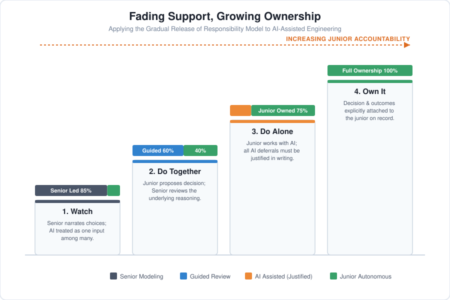

# Training Juniors Is an Architecture Choice

Software engineering was quietly compressing itself for twenty years before AI ever entered the picture:

* **"You build it, you run it"** folded operations directly into the developer's job.
* **Agile methodology** made testing "everyone's responsibility," absorbing dedicated QA roles.
* **Cloud tooling** made infrastructure work absorbable by generalists instead of specialists.

By the time AI-assisted coding became standard, engineering organizations had already stripped out most of their operational slack. Dedicated QA staffing had been declining for years. At plenty of companies, including major tech leaders, there is simply no separate safety net checking a developer's work anymore.

**AI did not cause this compression; it exposed it.** It made structural thinness visible in the same way AI-driven load exposed GitHub's infrastructure: a platform that survived years of ordinary traffic without stress-testing its autoscaling policies or editor retry bugs until extreme load triggered an eight-hour global outage. Nothing about that failure was new. It was old and dormant. AI simply supplied enough volume, fast enough, to make quiet coping impossible.

Labor data tells the same story from the opposite direction. Employment for developers in their early twenties has fallen sharply since 2022, while senior employment has held steady or grown. Fewer juniors are entering a system with less room for them, and those who do arrive are handed tools that make it remarkably easy to skip the exact steps where engineering judgment used to form.

---

## The Blind Spot: Two Shortcuts That Skip Real Design Work

### Instinct 1: Banning AI entirely
The cheapest response is prohibiting AI in training (no curriculum redesign, no new rubric, just a blanket rule). It feels responsible because it attempts to protect vulnerable skills. A recent randomized trial found that developers who relied on AI while learning new material scored meaningfully lower on comprehension quizzes than those working by hand. The gap was most severe in **debugging**: the critical skill of recognizing that code is wrong and figuring out why.

However, banning the tool does not build the muscle it seeks to protect. It merely delays the learner's first unsupervised collision with AI until they are on the job, working in a production codebase with real consequences. Aviation ran this exact experiment and corrected course: discouraging automation failed because it left pilots without structured practice in manual flying under realistic conditions. What worked was **scheduling deliberate, manual practice on purpose.**

### Instinct 2: Teaching AI Literacy
When bans prove unrealistic, organizations shift to teaching tool fluency: prompt engineering and output optimization. While better than a ban, this hits the wrong layer. The same study revealed that outcomes depended on *how* developers used AI, not *whether* they used it:

* **High performers:** Developers who asked conceptual questions first, then coded independently and troubleshot their own errors, scored highest and moved quickly.
* **Low performers:** Developers who delegated tasks wholesale (or gradually slipped into total delegation) scored worst and gained no meaningful speed advantage.

A developer can be highly fluent in prompting while entirely outsourcing critical thinking. AI literacy alone does not address that gap.

___

Both instincts bypass the core design challenge: **deciding when and how AI support is systematically withdrawn as a learner develops.** A human mentor does this naturally, fading assistance as competence grows. AI tools do the opposite; they persist and adapt by default. Unless this "fade" is intentionally engineered from the outside, skill transfer quietly fails.

---

## The Fix: Designing the Gradual Fade

The solution exists in education's 40-year-old **Gradual Release of Responsibility** model. Handing over full responsibility instantly prevents judgment from forming; delaying it forever prevents autonomy.

When applied to AI, the four stages adjust so that the **AI relationship itself is systematically faded**:

* **Watch:** A senior engineer makes a real decision and narrates their process out loud (including where they use AI, and where they override or ignore it). The junior sees AI treated as one input among many, not an oracle.
* **Do Together (Reviewed):** The junior proposes a decision using AI assistance, but a senior reviews the *reasoning* behind the choice, not just whether the code runs. Most curricula skip this because validating reasoning takes senior engineering time.
* **Do Alone (Justified):** The junior works directly with AI, but must explicitly document and justify every instance where they deferred to the model. This makes delegation conscious and visible rather than automatic.
* **Own It (Named):** The final decision and its real-world outcome are explicitly attached to the junior on the record, rather than buried anonymously in a merged pull request. Ownership of the outcome, not just involvement in producing it, is what the psychology of accountability consistently finds actually builds a sense of responsibility.

This approach mirrors aviation safety: **deliberately scheduled moments where automation is set aside** so underlying skills do not decay.

### The Enforced Checkpoint Asymmetry
Consider a stark contrast: military targeting systems have compressed decision windows from days to minutes, yet human sign-off before a strike remains mandatory policy. Software engineering lacks any equivalent enforced checkpoint. Nothing structurally forces a human to pause and own code before it ships. This missing safety net makes an intentionally designed fade far more urgent in software, as accountability will not enforce itself by default.

---

## The Practice: Core Curriculum Principles

A few concrete principles follow from this four-stage shape:

* **Protect unassisted debugging:** Debugging erodes fastest under AI reliance, yet it is the primary mechanism by which engineers discover flawed logic before consequences become expensive. Juniors must spend real, uncomfortable hours tracing failing tests before AI is re-introduced.
* **Assign work requiring non-codified context:** Focus exercises on tasks AI structurally cannot access, not because a future model might close the gap, but because the context was never written down anywhere for a model to learn from: interviewing stakeholders, navigating undocumented system history, and balancing unwritten business constraints.
* **Sequence growth intentionally:** Introduce AI stages deliberately rather than reactively under pressure. As argued in [Architecture Is a Felt Contrast](ArchitectureIsaFeltContrast.md), learners need isolated, deliberate constraints rather than chaotic exposures. Each stage should be gated by demonstrated competence.
* **Make ownership visible:** If contributions and mistakes dissolve anonymously into merged branches, the final stage of accountability never occurs. Technical boundaries are critical for system stability, but code architecture ultimately mirrors organizational ownership. When individual responsibility is blurred, personal growth and system architecture degrade together.

---

## The Insight: Faster Elevation, Thinner Foundations

Combining labor trends with educational research reveals the true challenge: fewer juniors are being hired, and those who enter join organizations already stripped of the safety nets (dedicated QA, dedicated ops) that once cushioned early mistakes. Simultaneously, AI tools make it easy to generate plausible outputs without developing underlying judgment.

However, responsibility has not shifted to the tool. A model lacks a career, a team, or a stake in outcomes; it cannot hold accountability. Instead, the human role has become far more exposed. Earlier tools sped up execution once a person had already decided; AI increasingly proposes the decision itself. When AI generates the decision, the human's sole remaining role is evaluating whether to accept it: a narrower, higher-stakes position than simply writing code faster.

This is not about AI replacing junior developers. It is about replacing **accidental mentorship** (where juniors absorbed judgment by observing senior engineers) with an **intentional curriculum**. The informal, passive model of learning cannot survive tools that continuously supply immediate answers.

## The Production Bottom Line

**The fade must be designed, not assumed.** AI did not create the pressure squeezing junior engineers; twenty years of role compression did. AI simply arrived with the speed and volume required to make that thinness impossible to ignore.

Responsibility for engineering decisions never transfers to a tool. In the past, the gradual transfer of judgment occurred naturally, absorbed invisibly from senior colleagues. That transfer cannot happen around an automated assistant that adapts constantly and never steps back on its own. A junior who never learns to hold a decision alone is not a flawed engineer by nature; they are the predictable result of an undesigned curriculum in an era where passive learning is no longer enough.