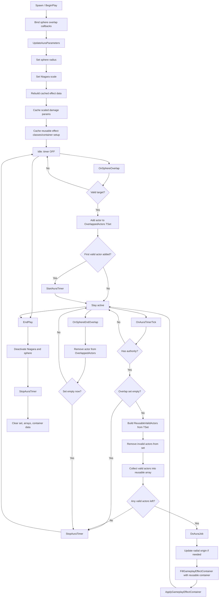
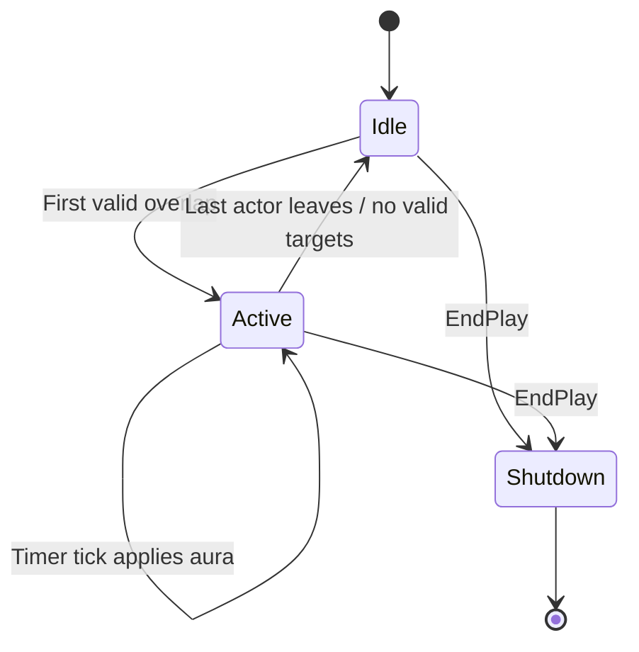
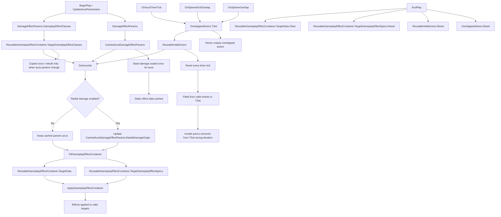

### Aura flow

```mermaid
flowchart TD
A[Spawn / BeginPlay] --> B[Bind sphere overlap callbacks]
B --> C[UpdateAuraParameters]
C --> C1[Set sphere radius]
C1 --> C2[Set Niagara scale]
C2 --> C3[Rebuild cached effect data]
C3 --> C4[Cache scaled damage params]
C4 --> C5[Cache reusable effect classes/container setup]
C5 --> D[Idle: timer OFF]

    D --> E[OnSphereOverlap]
    E --> F{Valid target?}
    F -- No --> D
    F -- Yes --> G[Add actor to OverlappedActors TSet]
    G --> H{First valid actor added?}
    H -- No --> I[Stay active]
    H -- Yes --> J[StartAuraTimer]
    J --> I

    I --> K[OnAuraTimerTick]
    K --> L{Has authority?}
    L -- No --> I
    L -- Yes --> M{Overlap set empty?}
    M -- Yes --> N[StopAuraTimer]
    N --> D
    M -- No --> O[Build ReusableValidActors from TSet]
    O --> O1[Remove invalid actors from set]
    O1 --> O2[Collect valid actors into reusable array]
    O2 --> P{Any valid actors left?}
    P -- No --> N
    P -- Yes --> Q[DoAuraJob]
    Q --> R[Update radial origin if needed]
    R --> S[FillGameplayEffectContainer with reusable container]
    S --> T[ApplyGameplayEffectContainer]
    T --> I

    I --> U[OnSphereEndOverlap]
    U --> V[Remove actor from OverlappedActors]
    V --> W{Set empty now?}
    W -- No --> I
    W -- Yes --> N

    D --> X[EndPlay]
    I --> X
    X --> Y[Deactivate Niagara and sphere]
    Y --> Z[StopAuraTimer]
    Z --> AA[Clear set, arrays, container data]
```
### Aura state diagram

```mermaid
stateDiagram-v2
    [*] --> Idle
    Idle --> Active: First valid overlap
    Active --> Active: Timer tick applies aura
    Active --> Idle: Last actor leaves / no valid targets
    Idle --> Shutdown: EndPlay
    Active --> Shutdown: EndPlay
    Shutdown --> [*]
```
### Aura data flow

```mermaid
flowchart TD
    A[BeginPlay / UpdateAuraParameters] --> B[DamageEffectParams]
    B --> C[CachedAuraDamageEffectParams]
    C --> C1[Base damage scaled once for aura]
    C1 --> C2[Static effect data cached]

    A --> D[DamageEffectParams.GameplayEffectClasses]
    D --> E[ReusableGameplayEffectContainer.TargetGameplayEffectClasses]
    E --> E1[Copied once / rebuilt only when aura params change]

    F[OnSphereOverlap] --> G[OverlappedActors TSet]
    G --> G1[Stores unique overlapped actors]
    H[OnSphereEndOverlap] --> G
    I[OnAuraTimerTick] --> G

    G --> J[ReusableValidActors]
    J --> J1[Reset every timer tick]
    J1 --> J2[Filled from valid entries in TSet]
    J2 --> J3[Invalid actors removed from TSet during iteration]

    J --> K[DoAuraJob]
    C --> K
    E --> K

    K --> L{Radial damage enabled?}
    L -- Yes --> M[Update CachedAuraDamageEffectParams.RadialDamageOrigin]
    L -- No --> N[Keep cached params as-is]

    M --> O[FillGameplayEffectContainer]
    N --> O

    O --> P[ReusableGameplayEffectContainer.TargetGameplayEffectSpecs]
    O --> Q[ReusableGameplayEffectContainer.TargetData]

    P --> R[ApplyGameplayEffectContainer]
    Q --> R

    R --> S[Effects applied to valid targets]

    T[EndPlay] --> U[OverlappedActors.Reset]
    T --> V[ReusableValidActors.Reset]
    T --> W[ReusableGameplayEffectContainer.TargetGameplayEffectSpecs.Reset]
    T --> X[ReusableGameplayEffectContainer.TargetData.Clear]
```