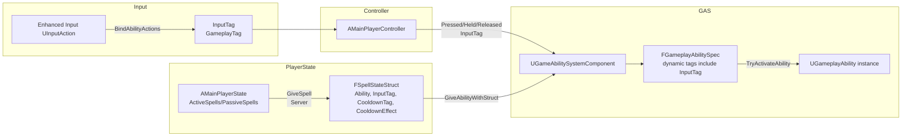
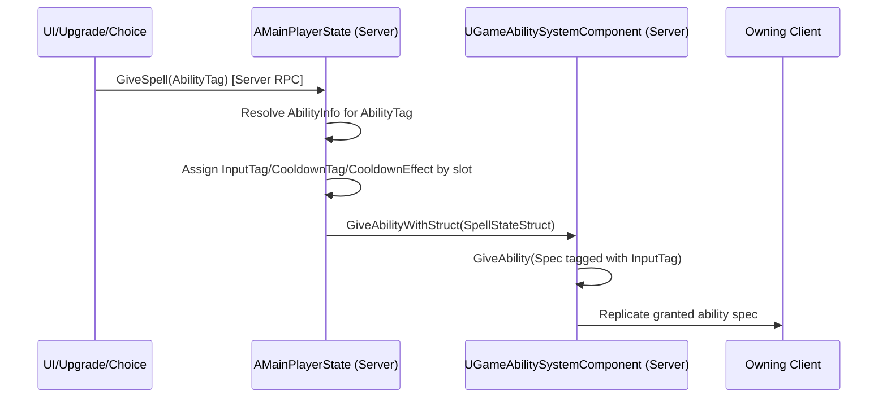
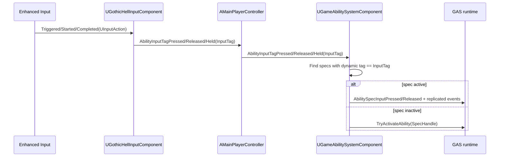
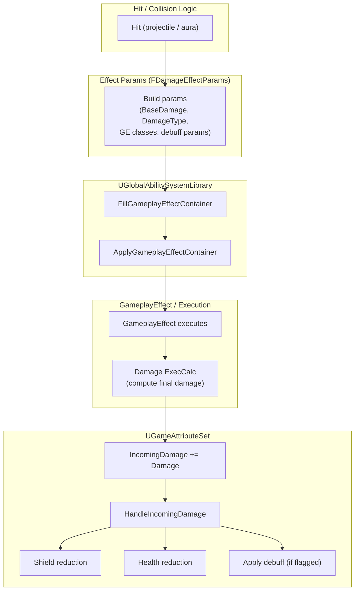

# Spell System Documentation (GothicHell)

This document summarizes the spell system **architecture**, **data flow**, and a **safe process to add new spells**, based on the implementation across PlayerState, PlayerController, ASC, BaseGameplayAbility, spell actors, tags, and damage pipeline.

---

## 1) Architecture

### 1.1 Key modules and responsibilities

| Layer | Main Types | Responsibility | Notes |
|---|---|---|---|
| Input | `UGothicHellInputComponent`, `AMainPlayerController` | Bind Enhanced Input `UInputAction` to **GameplayTags** (InputTags), forward to ASC | Input binds to tags, not directly to abilities |
| Ability registry / ownership | `AMainPlayerState` | Authoritative spell list: Active/Passive/Relics arrays, assigns **InputTag** and **CooldownTag/Effect** per slot | Server-only granting |
| Ability runtime | `UGameAbilitySystemComponent` (GASC) | Grants specs, stores InputTags in spec dynamic tags, processes tag-based input press/hold/release to activate abilities | Tag → Spec lookup |
| Base ability behavior | `UBaseGameplayAbility` | Common params, cooldown metadata, randomization on grant (player), auto-activate passive/special, upgrade switchers for projectiles | Uses ability asset tag as identity (`GetAssetTags().First()`) |
| Spell actors | `ABaseAbilityActor`, `AProjectileActor`, `AAuraWithMagicCircleActor` | Replication base; projectile movement/collision/lifetime/damage; aura overlap ticking damage | Damage is server-authoritative |
| Damage pipeline | `UGlobalAbilitySystemLibrary`, `UExecCalc_Damage`, `UGameAttributeSet` | Build/apply GE specs; compute final damage; apply to shield/health via IncomingDamage meta attribute; spawn debuffs | Centralized damage application |

---

### 1.2 High-level diagram

---

## 2) Data Flow

### 2.1 Spell granting flow (server-authoritative)

**Key properties:**
- **Only the server grants abilities** (`HasAuthority()` checks in PlayerState and CharacterBase startup).
- `FSpellStateStruct` is the “spell loadout slot” payload: ability + input tag + cooldown metadata.

---

### 2.2 Input → activation flow

**Important invariant:** input binds to **InputTag**, and specs must be tagged with that same InputTag to be activatable.

---

### 2.3 Damage application flow

---

## 3) GameplayTags used by spells

### 3.1 Spell categories (type)
| Purpose | Tag |
|---|---|
| Active spell | `Spell.Type.Active` |
| Passive spell | `Spell.Type.Passive` |
| Special spell | `Spell.Type.Special` |
| None | `Spell.Type.None` |

### 3.2 Input tags (ability trigger identity)
| Slot/Input | Tag |
|---|---|
| LMB | `InputTag.LMB` |
| RMB | `InputTag.RMB` |
| 1..4 | `InputTag.1` … `InputTag.4` |
| Passive slots | `InputTag.Passive.1`, `InputTag.Passive.2` |
| Space | `InputTag.Space` |

### 3.3 Blocking tags (prevent triggering)
| Purpose | Tag |
|---|---|
| Block pressed callback | `Player.Block.InputPressed` |
| Block held callback | `Player.Block.InputHeld` |
| Block released callback | `Player.Block.InputReleased` |
| Block cursor trace | `Player.Block.CursorTrace` |

### 3.4 Status effects
| Category | Tags |
|---|---|
| Debuffs (states) | `Debuff.Burn`, `Debuff.Stun`, `Debuff.Void`, `Debuff.Shock`, `Debuff.Freeze`, `Debuff.Toxic`, `Debuff.Corrupt`, `Debuff.Purity` |
| Hit react | `Effects.HitReact` |
| Debuff params (SetByCaller/context) | `Debuff.Chance`, `Debuff.Damage`, `Debuff.Duration`, `Debuff.Frequency` |

### 3.5 Cooldowns
- No native `Cooldown.*` hierarchy is defined in the code.
- Cooldown is driven by `FSpellStateStruct.CooldownTag` + `CooldownEffect`, and UI watches for that tag being granted/removed.

**Cooldown tag pattern requirement:** the cooldown GameplayEffect must include the `CooldownTag` as either an asset tag or granted tag, otherwise UI cooldown tracking won’t work.

---

## 4) Create a new spell safely

### 4.1 Minimal requirements

| Item | Why it’s required | Where it’s used |
|---|---|---|
| **AbilityInfo entry** with `AbilityTag`, `AbilityType`, `Ability` class | PlayerState grants by tag and decides active/passive/special behavior | `AMainPlayerState::GiveSpell` + ability info lookups |
| Ability class has a stable **asset tag identity** | Code assumes `GetAssetTags().First()` is “the ability tag” | Used in base ability logic + ability lookup |
| Ability spec gets an **InputTag** (if activatable) | Input routing is InputTag → spec dynamic tags | `UGameAbilitySystemComponent::AbilityInputTag*` |
| CooldownEffect grants the **CooldownTag** (if you want cooldown UI) | Cooldown UI listener checks tags | `UWaitCooldownChange` |

### 4.2 Recommended process

#### Step A — Define tags & metadata
1. Create/choose a `Spell.*` gameplay tag for `AbilityTag` (category “Spell”).
2. Choose `AbilityType` from `Spell.Type.*`.

**Do not:** reuse an existing spell tag for a different spell class unless you intend it to be the same identity everywhere.

#### Step B — Implement the ability class
- Prefer deriving from `UBaseGameplayAbility` or `UDamageGameplayAbility`.

**If it’s an active spell:** override `ActivateAbility(...)` and call `Super::ActivateAbility(...)` unless you intentionally want to skip base behavior.

**If it’s passive/special:** be aware the base class may auto-activate on grant, so your ActivateAbility must be safe to run immediately.

#### Step C — Define damage/effects
- Put damage and secondary effects into `FDamageEffectParams.GameplayEffectClasses`.
- Ensure your damage GameplayEffect uses your execution calculation (or otherwise modifies `IncomingDamage`).

#### Step D — Ensure cooldown wiring
- Ensure the cooldown GE grants the same tag as `FSpellStateStruct.CooldownTag` for that slot.
- Confirm UI uses `UWaitCooldownChange` against that cooldown tag.

#### Step E — Grant and bind
- If granted through PlayerState spell selection: it will receive slot InputTag + CooldownTag automatically.
- If granted as “startup ability”: set `StartupInputTag` on the ability defaults so specs are tagged.

### Silent failures

| Failure                                                                | Cause                                                                            |
|------------------------------------------------------------------------|----------------------------------------------------------------------------------|
| Ability has a stable single identity tag (`Spell.*`) in its asset tags | Ability lookup/type resolution can fail or use the wrong tag                     |
| Granted ability spec must have the correct `InputTag` dynamic tag      | Input won’t activate the ability (looks like “input broken”)                     |
| Cooldown GE must grant the exact CooldownTag the UI watches            | Cooldown UI never updates / cooldown events never fire                           |
| Damage should flow through `IncomingDamage` + AttributeSet handler     | You get double damage, inconsistent shields, or no debuffs/knockback/death hooks |
| Passive/Special abilities must be safe to auto-activate on grant       | Granting passives causes unexpected spawns/loops/crashes                         |

### Safety checklist

| Step | Done? | Notes |
|---|---:|---|
| Create `Spell.<Name>` tag | ☐ | Project Settings → Gameplay Tags |
| Create/choose `Damage.<Type>` tag | ☐ | Optional but recommended |
| Create `GA_<Name>` derived from base ability | ☐ | Add single spell identity asset tag |
| Create `GE_Damage_<Name>` | ☐ | Instant + ExecCalc + SetByCaller support |
| Create cooldown GE(s) that grant the slot cooldown tag | ☐ | Slot-based recommended |
| Add AbilityInfo entry for `Spell.<Name>` | ☐ | Links tag → ability class → type |
| Implement ActivateAbility (server spawn/apply) | ☐ | Call `Super` unless intentionally skipping base behavior |
| Test: grant → input triggers → cooldown UI updates → damage applies | ☐ | Test in listen-server PIE if possible |

---

## 5) What NOT to break (system invariants)

### 5.1 Ability identity tag invariant
Many systems assume:
- **Each ability has one primary identifying asset tag**
- It is accessible as `GetAssetTags().First()`

**Do not break by:**
- Removing asset tags from abilities
- Giving multiple identity tags and changing order unpredictably

### 5.2 Input system invariant
Activation depends on:
- `FGameplayAbilitySpec` dynamic tags containing the correct `InputTag`

**Do not break by:**
- Granting abilities without tagging the spec with an InputTag (for active spells)
- Changing InputTags without updating input config / spell grant logic

### 5.3 Cooldown UI invariant
Cooldown detection depends on the cooldown tag being present in:
- GE Asset Tags **or** Granted Tags

**Do not break by:**
- Using cooldown effects that don’t grant/carry the expected cooldown tag

### 5.4 Damage pipeline invariant
Damage math assumes:
- Damage types are SetByCaller magnitudes keyed by `Damage.<Type>` tags
- Final damage is written into `IncomingDamage`
- Actual health/shield changes occur only in AttributeSet handler

**Do not break by:**
- Applying “direct Health -X” effects for damage while also using IncomingDamage (double damage / inconsistent visuals)
- Bypassing `IncomingDamage` unless you intentionally opt out of the unified pipeline

---

## 6) Performance constraints / hot paths

### 6.1 Input → ability activation loop
`UGameAbilitySystemComponent::AbilityInputTagPressed/Held/Released` loops through all activatable abilities and checks tags.

**Implication:** cost is O(number of activatable specs) per input event.

**Guideline:**
- Keep the number of activatable specs reasonable (especially for players).
- Avoid spamming Held events for many actions unless necessary.

### 6.2 Aura tick damage
Auras are implemented as ticking actors that apply effects periodically (server-side).

**Implication:** each aura tick can:
- process overlap lists
- build GE containers
- apply effects (potentially to multiple actors)

**Guideline:**
- Keep tick interval conservative
- Keep overlap set and target list bounded

### 6.3 Projectile overlap cost
Projectiles apply damage on overlap (server). Some behaviors (chain/explosion/radial) may:
- query cached enemy lists
- apply multiple effect specs
- spawn additional actors

**Guideline:**
- Be careful with high `MaxNumChains`, `MaxNumExplosions`, large AoE radii, and frequent spawns
- Prefer cached queries (you already use cached enemy lists) and limit per-hit expansions

### 6.4 Damage execution calculation cost
`UExecCalc_Damage` captures many attributes and processes multiple damage types/resistance entries.

**Guideline:**
- Avoid adding many extra damage-type SetByCaller magnitudes per hit unless needed
- Keep curve table lookups stable (they’re per execution)

---

## 7) Spell types

| Spell type | Must provide | Typical implementation |
|---|---|---|
| Active projectile | AbilityInfo entry, ability asset tag, ability class, projectile actor (optional), damage GE(s), cooldown GE tag | `UDamageGameplayAbility::ActivateAbility` → spawn `AProjectileActor` with `FDamageEffectParams` |
| Passive aura | AbilityInfo type Passive, safe ActivateAbility, periodic effect (dynamic debuff or periodic GE), optional aura actor | `UAuraAbility`-style: spawn aura actor on authority, listen to attribute changes |
| Utility / special | AbilityInfo type Special, safe auto-activation on grant, clear cleanup on EndAbility | Base class may auto-activate; ensure idempotence |

---

## 8) Summary

- **Input maps to tags.** Tags map to **ability specs** via dynamic tags.
- **Server grants spells** via PlayerState; client only drives input.
- **Abilities are identified by asset tags** (first asset tag is treated as the “AbilityTag”).
- **Damage is unified:** ExecCalc produces `IncomingDamage`; AttributeSet applies it to shield/health and triggers debuffs/knockback/death.
- **Cooldowns are tag-driven:** UI watches a `CooldownTag` that must be granted by the cooldown GE.